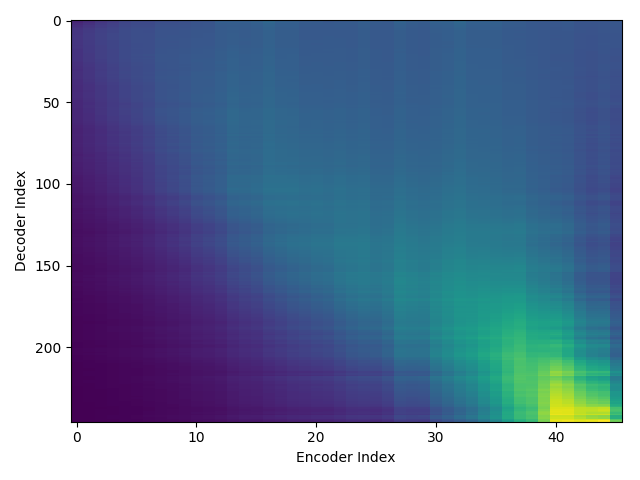
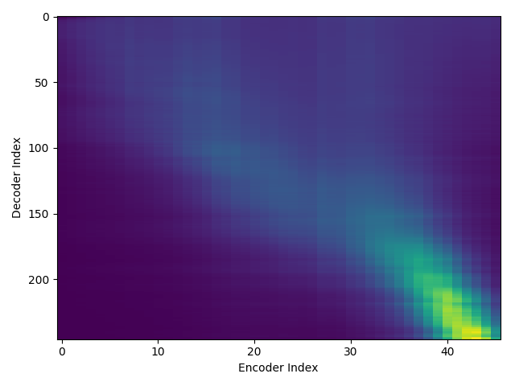
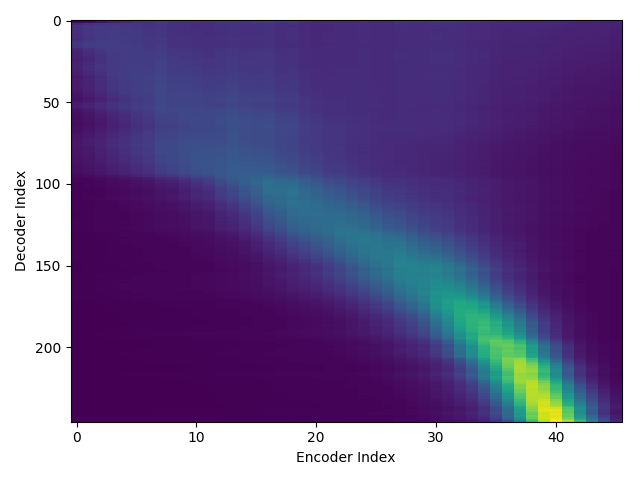
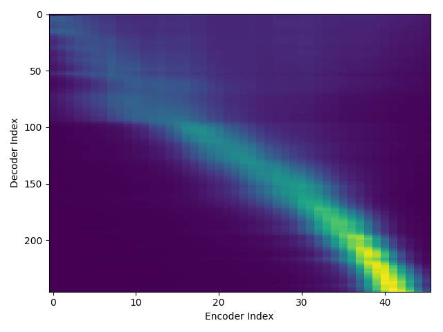
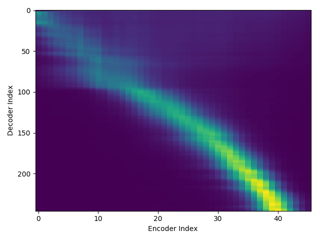
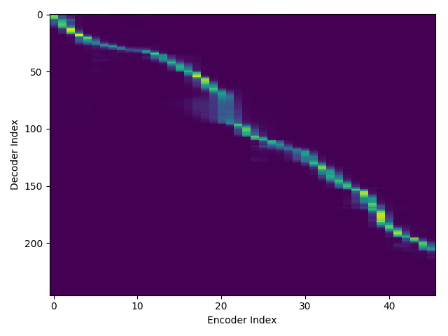

# demo190820

## lab file (Original lab file of blizzard17)

    ThereWasACrookedMan_01_Track_01_000105-000280 there was a crooked man 
    <audio src="wav/ThereWasACrookedMan_01_Track_01_000105-000280.wav" controls></audio>

## new_lab file (Created lab file from text file blizzard17)

### attention_weight

| epoch | attention_weight |  
| --- | --- |  
| 1 |  |  
| 2 |  |  
| 3 |  |  
| 4 |  |  
| 5 |  |  
| ... | ... |  
| 100 |  |  

### wav

"screeched the rooster, flying across the roof. "  
<audio src="blizzard17/train_no_dev_pytorch_train_pytorch_tacotron2.tuning.lab3-rev1/outputs_model.last1.avg.best_decode_denorm/dev/wav/TheMusiciansOfBremen_21_Track_21_000185-000429.wav" controls></audio>  
  

"screamed the robber, running away as fast as he could. "  
<audio src="blizzard17/train_no_dev_pytorch_train_pytorch_tacotron2.tuning.lab3-rev1/outputs_model.last1.avg.best_decode_denorm/dev/wav/TheMusiciansOfBremen_21_Track_21_000568-000854.wav" controls></audio>  
  

"there's a horrible witch in the house, he panted. "  
<audio src="blizzard17/train_no_dev_pytorch_train_pytorch_tacotron2.tuning.lab3-rev1/outputs_model.last1.avg.best_decode_denorm/dev/wav/TheMusiciansOfBremen_22_Track_22_000025-000301.wav" controls></audio>  
  

"she spat at me and scratched me. "  
<audio src="blizzard17/train_no_dev_pytorch_train_pytorch_tacotron2.tuning.lab3-rev1/outputs_model.last1.avg.best_decode_denorm/dev/wav/TheMusiciansOfBremen_22_Track_22_000315-000543.wav" controls></audio>  
  

"there was a man with a knife by the door. "  
<audio src="blizzard17/train_no_dev_pytorch_train_pytorch_tacotron2.tuning.lab3-rev1/outputs_model.last1.avg.best_decode_denorm/dev/wav/TheMusiciansOfBremen_23_Track_23_000037-000234.wav" controls></audio>  
  

<!--
TheMusiciansOfBremen_21_Track_21_000185-000429 screeched the rooster, flying across the roof. 
TheMusiciansOfBremen_21_Track_21_000568-000854 screamed the robber, running away as fast as he could. 
TheMusiciansOfBremen_22_Track_22_000025-000301 there's a horrible witch in the house, he panted. 
TheMusiciansOfBremen_22_Track_22_000315-000543 she spat at me and scratched me. 
TheMusiciansOfBremen_23_Track_23_000037-000234 there was a man with a knife by the door. 
TheMusiciansOfBremen_23_Track_23_000294-000436 he stabbed me in the leg. 
TheMusiciansOfBremen_23_Track_23_000541-000759 in the yard there's a big, black monster. 
TheMusiciansOfBremen_23_Track_23_000808-000945 he beat me with his club. 
TheMusiciansOfBremen_24_Track_24_000025-000262 the robbers never went back to the house again. 
TheMusiciansOfBremen_24_Track_24_000380-000733 as for the four friends, they never did go to bremen. 
--->
