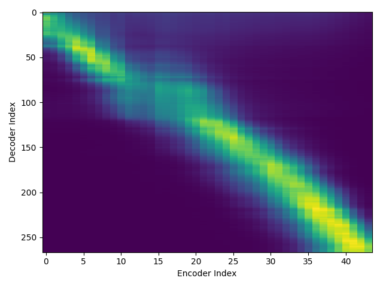

# demo190820

## lab1 file (Original lab file of blizzard17)

### attention_weight

| epoch | lab1-rev1 | lab1-rev2 | lab1-rev3 | lab1-rev4 | lab1-rev5 |  
| --- | --- | --- | --- | --- | --- |  
| epoch | **v3_1** | **v3_2** | **v3_3** | **v3_4** | **v3_5** |  
| 1 |  |  |  |  |  |  
| 2 |  |  |  |  |  |  
| 3 |  |  |  |  |  |  
| 4 |  |  |  |  |  |  
| 5 |  |  |  |  |  |  
| ... | ... | ... | ... | ... | ... |  
| X | 94    | 110    | 84    | 98    |  100    |  
| Y | NULL | 200    | NULL | NULL | 138    | 

### wav

| wav | **v3_1** |  **v3_2** |  **v3_3** |  
| --- | --- | --- | --- |  
| "screeched the rooster, flying across the roof. "         | <audio src="blizzard17/train_no_dev_pytorch_train_pytorch_tacotron2.v3_1/outputs_model.last1.avg.best_decode_denorm/dev/wav/TheMusiciansOfBremen_21_Track_21_000162-000471.wav" controls></audio>    | <audio src="blizzard17/train_no_dev_pytorch_train_pytorch_tacotron2.v3_2/outputs_model.last1.avg.best_decode_denorm/dev/wav/TheMusiciansOfBremen_21_Track_21_000162-000471.wav" controls></audio>    | <audio src="blizzard17/train_no_dev_pytorch_train_pytorch_tacotron2.v3_3/outputs_model.last1.avg.best_decode_denorm/dev/wav/TheMusiciansOfBremen_21_Track_21_000162-000471.wav" controls></audio>    | <audio src="blizzard17/train_no_dev_pytorch_train_pytorch_tacotron2.v3_4/outputs_model.last1.avg.best_decode_denorm/dev/wav/TheMusiciansOfBremen_21_Track_21_000162-000471.wav" controls></audio>    | <audio src="blizzard17/train_no_dev_pytorch_train_pytorch_tacotron2.v3_5/outputs_model.last1.avg.best_decode_denorm/dev/wav/TheMusiciansOfBremen_21_Track_21_000162-000471.wav" controls></audio>    |  
| "screamed the robber, running away as fast as he could. " | <audio src="blizzard17/train_no_dev_pytorch_train_pytorch_tacotron2.v3_1/outputs_model.last1.avg.best_decode_denorm/dev/wav/TheMusiciansOfBremen_21_Track_21_000543-000889.wav" controls></audio>    | <audio src="blizzard17/train_no_dev_pytorch_train_pytorch_tacotron2.v3_2/outputs_model.last1.avg.best_decode_denorm/dev/wav/TheMusiciansOfBremen_21_Track_21_000543-000889.wav" controls></audio>    | <audio src="blizzard17/train_no_dev_pytorch_train_pytorch_tacotron2.v3_3/outputs_model.last1.avg.best_decode_denorm/dev/wav/TheMusiciansOfBremen_21_Track_21_000543-000889.wav" controls></audio>    | <audio src="blizzard17/train_no_dev_pytorch_train_pytorch_tacotron2.v3_4/outputs_model.last1.avg.best_decode_denorm/dev/wav/TheMusiciansOfBremen_21_Track_21_000543-000889.wav" controls></audio>    | <audio src="blizzard17/train_no_dev_pytorch_train_pytorch_tacotron2.v3_5/outputs_model.last1.avg.best_decode_denorm/dev/wav/TheMusiciansOfBremen_21_Track_21_000543-000889.wav" controls></audio>    |  
| "there's a horrible witch in the house, he panted. "      | <audio src="blizzard17/train_no_dev_pytorch_train_pytorch_tacotron2.v3_1/outputs_model.last1.avg.best_decode_denorm/dev/wav/TheMusiciansOfBremen_22_Track_22_000000-000309.wav" controls></audio>    | <audio src="blizzard17/train_no_dev_pytorch_train_pytorch_tacotron2.v3_2/outputs_model.last1.avg.best_decode_denorm/dev/wav/TheMusiciansOfBremen_22_Track_22_000000-000309.wav" controls></audio>    | <audio src="blizzard17/train_no_dev_pytorch_train_pytorch_tacotron2.v3_3/outputs_model.last1.avg.best_decode_denorm/dev/wav/TheMusiciansOfBremen_22_Track_22_000000-000309.wav" controls></audio>    | <audio src="blizzard17/train_no_dev_pytorch_train_pytorch_tacotron2.v3_4/outputs_model.last1.avg.best_decode_denorm/dev/wav/TheMusiciansOfBremen_22_Track_22_000000-000309.wav" controls></audio>    | <audio src="blizzard17/train_no_dev_pytorch_train_pytorch_tacotron2.v3_5/outputs_model.last1.avg.best_decode_denorm/dev/wav/TheMusiciansOfBremen_22_Track_22_000000-000309.wav" controls></audio>    |  
| "she spat at me and scratched me. "                       | <audio src="blizzard17/train_no_dev_pytorch_train_pytorch_tacotron2.v3_1/outputs_model.last1.avg.best_decode_denorm/dev/wav/TheMusiciansOfBremen_22_Track_22_000309-000578.wav" controls></audio>    | <audio src="blizzard17/train_no_dev_pytorch_train_pytorch_tacotron2.v3_2/outputs_model.last1.avg.best_decode_denorm/dev/wav/TheMusiciansOfBremen_22_Track_22_000309-000578.wav" controls></audio>    | <audio src="blizzard17/train_no_dev_pytorch_train_pytorch_tacotron2.v3_3/outputs_model.last1.avg.best_decode_denorm/dev/wav/TheMusiciansOfBremen_22_Track_22_000309-000578.wav" controls></audio>    | <audio src="blizzard17/train_no_dev_pytorch_train_pytorch_tacotron2.v3_4/outputs_model.last1.avg.best_decode_denorm/dev/wav/TheMusiciansOfBremen_22_Track_22_000309-000578.wav" controls></audio>    | <audio src="blizzard17/train_no_dev_pytorch_train_pytorch_tacotron2.v3_5/outputs_model.last1.avg.best_decode_denorm/dev/wav/TheMusiciansOfBremen_22_Track_22_000309-000578.wav" controls></audio>    |  
| "there was a man with a knife by the door. "              | <audio src="blizzard17/train_no_dev_pytorch_train_pytorch_tacotron2.v3_1/outputs_model.last1.avg.best_decode_denorm/dev/wav/TheMusiciansOfBremen_23_Track_23_000006-000257.wav" controls></audio>    | <audio src="blizzard17/train_no_dev_pytorch_train_pytorch_tacotron2.v3_2/outputs_model.last1.avg.best_decode_denorm/dev/wav/TheMusiciansOfBremen_23_Track_23_000006-000257.wav" controls></audio>    | <audio src="blizzard17/train_no_dev_pytorch_train_pytorch_tacotron2.v3_3/outputs_model.last1.avg.best_decode_denorm/dev/wav/TheMusiciansOfBremen_23_Track_23_000006-000257.wav" controls></audio>    | <audio src="blizzard17/train_no_dev_pytorch_train_pytorch_tacotron2.v3_4/outputs_model.last1.avg.best_decode_denorm/dev/wav/TheMusiciansOfBremen_23_Track_23_000006-000257.wav" controls></audio>    | <audio src="blizzard17/train_no_dev_pytorch_train_pytorch_tacotron2.v3_5/outputs_model.last1.avg.best_decode_denorm/dev/wav/TheMusiciansOfBremen_23_Track_23_000006-000257.wav" controls></audio>    |  

## lab2 file (Created lab file from text file blizzard17)

### attention_weight

| epoch | **lab2-rev1** |  
| --- | --- |  
| 1 |  |  
| 2 |  |  
| 3 |  |  
| 4 |  |  
| 5 |  |  
| ... | ... |  
| 100 |  |  

### wav

| wav | **lab2-rev1** |  
| --- | --- |  
| "screeched the rooster, flying across the roof. "         | <audio src="blizzard17/train_no_dev_pytorch_train_pytorch_tacotron2.v4/outputs_model.last1.avg.best_decode_denorm/dev/wav/TheMusiciansOfBremen_21_Track_21_000162-000471.wav" controls></audio>    |  
| "screamed the robber, running away as fast as he could. " | <audio src="blizzard17/train_no_dev_pytorch_train_pytorch_tacotron2.v4/outputs_model.last1.avg.best_decode_denorm/dev/wav/TheMusiciansOfBremen_21_Track_21_000543-000889.wav" controls></audio>    |  
| "there's a horrible witch in the house, he panted. "      | <audio src="blizzard17/train_no_dev_pytorch_train_pytorch_tacotron2.v4/outputs_model.last1.avg.best_decode_denorm/dev/wav/TheMusiciansOfBremen_22_Track_22_000000-000309.wav" controls></audio>    |  
| "she spat at me and scratched me. "                       | <audio src="blizzard17/train_no_dev_pytorch_train_pytorch_tacotron2.v4/outputs_model.last1.avg.best_decode_denorm/dev/wav/TheMusiciansOfBremen_22_Track_22_000309-000578.wav" controls></audio>    |  
| "there was a man with a knife by the door. "              | <audio src="blizzard17/train_no_dev_pytorch_train_pytorch_tacotron2.v4/outputs_model.last1.avg.best_decode_denorm/dev/wav/TheMusiciansOfBremen_23_Track_23_000006-000257.wav" controls></audio>    |  

## lab3 file (Created lab file from text file blizzard17)

### attention_weight

| epoch | **lab3-rev1** |  
| --- | --- |  
| 1 |  |  
| 2 |  |  
| 3 |  |  
| 4 |  |  
| 5 |  |  
| ... | ... |  
| 100 |  |  

### wav

| wav | **lab3-rev1** |  
| --- | --- |  
| "screeched the rooster, flying across the roof. "         | <audio src="blizzard17/train_no_dev_pytorch_train_pytorch_tacotron2.tuning.lab3-rev1/outputs_model.last1.avg.best_decode_denorm/dev/wav/TheMusiciansOfBremen_21_Track_21_000185-000429.wav" controls></audio>    |  
| "screamed the robber, running away as fast as he could. " | <audio src="blizzard17/train_no_dev_pytorch_train_pytorch_tacotron2.tuning.lab3-rev1/outputs_model.last1.avg.best_decode_denorm/dev/wav/TheMusiciansOfBremen_21_Track_21_000568-000854.wav" controls></audio>    |  
| "there's a horrible witch in the house, he panted. "      | <audio src="blizzard17/train_no_dev_pytorch_train_pytorch_tacotron2.tuning.lab3-rev1/outputs_model.last1.avg.best_decode_denorm/dev/wav/TheMusiciansOfBremen_22_Track_22_000025-000301.wav" controls></audio>    |  
| "she spat at me and scratched me. "                       | <audio src="blizzard17/train_no_dev_pytorch_train_pytorch_tacotron2.tuning.lab3-rev1/outputs_model.last1.avg.best_decode_denorm/dev/wav/TheMusiciansOfBremen_22_Track_22_000315-000543.wav" controls></audio>    |  
| "there was a man with a knife by the door. "              | <audio src="blizzard17/train_no_dev_pytorch_train_pytorch_tacotron2.tuning.lab3-rev1/outputs_model.last1.avg.best_decode_denorm/dev/wav/TheMusiciansOfBremen_23_Track_23_000037-000234.wav" controls></audio>    |  

<!--
TheMusiciansOfBremen_21_Track_21_000185-000429 screeched the rooster, flying across the roof. 
TheMusiciansOfBremen_21_Track_21_000568-000854 screamed the robber, running away as fast as he could. 
TheMusiciansOfBremen_22_Track_22_000025-000301 there's a horrible witch in the house, he panted. 
TheMusiciansOfBremen_22_Track_22_000315-000543 she spat at me and scratched me. 
TheMusiciansOfBremen_23_Track_23_000037-000234 there was a man with a knife by the door. 
TheMusiciansOfBremen_23_Track_23_000294-000436 he stabbed me in the leg. 
TheMusiciansOfBremen_23_Track_23_000541-000759 in the yard there's a big, black monster. 
TheMusiciansOfBremen_23_Track_23_000808-000945 he beat me with his club. 
TheMusiciansOfBremen_24_Track_24_000025-000262 the robbers never went back to the house again. 
TheMusiciansOfBremen_24_Track_24_000380-000733 as for the four friends, they never did go to bremen. 
--->
