# demo190820

## lab1 file
(Original lab file of blizzard17)  

### Training condition & attention_weight
<!-- | epoch | Base | **v3_1** | **v3_2** | **v3_3** |   -->

| ID | lab1-rev0 | lab1-rev1 | lab1-rev2 | lab1-rev3 | 
| --- | --- | --- | --- | --- |  
| Start | 2019-07-04   20:32:36 | 2019-07-10   14:17:01 | 2019-07-11   11:32:59  | 2019-07-12   21:07:31 |  
| End | 2019-07-07   09:20:47 | 2019-07-11   02:03:06 | 2019-07-12   12:02:47 | 2019-07-13   08:44:42 |  
| Label | lab | lab | lab | lab |  
| lr | **1e-3** | 1e-4 | **1e-5** | 1e-4c |  
| atype | location | location | location | forward | 
| batch-size | 4 | 16 | 16 | 16 |  
| Max_epoch | 200 | 200 | 200 | 200 |  
| Patience | 0 | 20 | 40 | 20 |  
| Best_epoch | 24 | 74 | 200 | 66 |  
| End_epoch | 200 | 94 | 200 | 84 |  
| 1st epoch | 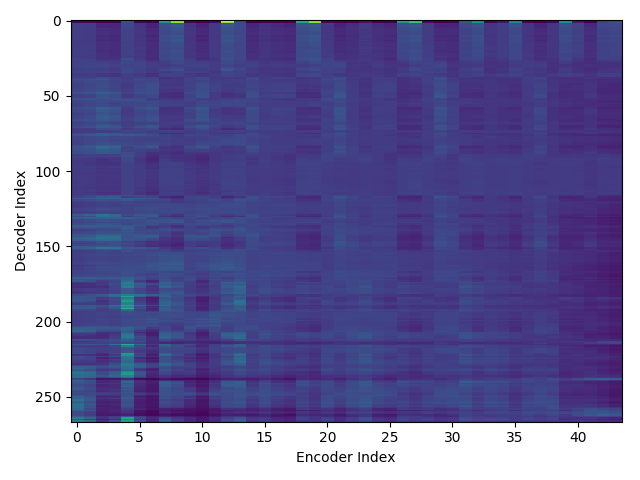 | 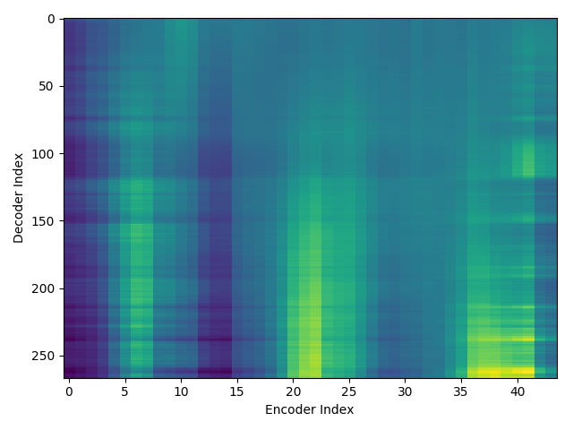 |  |  |  
| 2nd epoch |  |  |  |  |  
| 3rd epoch |  |  |  |  |  
| 4th epoch |  |  |  |  |  
| 5th epoch |  |  |  |  |  
| ... | ... | ... | ... | ... |  
| Xth epoch | 100    | 94    | 100    | 84    |  
| Yth epoch | 200    | NULL | 200    | NULL |  

### wav ~~& attention_weight~~

| ID | lab1-rev1 | lab1-rev2 | lab1-rev3 |  
| --- | --- | --- | --- |  
| TheMusiciansOfBremen_21_Track_21_000162-000471 | "screeched the rooster, flying across the roof. "           <audio src="blizzard17/train_no_dev_pytorch_train_pytorch_tacotron2.v3_1/outputs_model.last1.avg.best_decode_denorm/dev/wav/TheMusiciansOfBremen_21_Track_21_000162-000471.wav" controls></audio>  | "screeched the rooster, flying across the roof. "           <audio src="blizzard17/train_no_dev_pytorch_train_pytorch_tacotron2.v3_2/outputs_model.last1.avg.best_decode_denorm/dev/wav/TheMusiciansOfBremen_21_Track_21_000162-000471.wav" controls></audio> | "screeched the rooster, flying across the roof. "           <audio src="blizzard17/train_no_dev_pytorch_train_pytorch_tacotron2.v3_3/outputs_model.last1.avg.best_decode_denorm/dev/wav/TheMusiciansOfBremen_21_Track_21_000162-000471.wav" controls></audio> |  
| TheMusiciansOfBremen_21_Track_21_000543-000889 | "screamed the robber, running away as fast as he could. "   <audio src="blizzard17/train_no_dev_pytorch_train_pytorch_tacotron2.v3_1/outputs_model.last1.avg.best_decode_denorm/dev/wav/TheMusiciansOfBremen_21_Track_21_000543-000889.wav" controls></audio>  | "screamed the robber, running away as fast as he could. "   <audio src="blizzard17/train_no_dev_pytorch_train_pytorch_tacotron2.v3_2/outputs_model.last1.avg.best_decode_denorm/dev/wav/TheMusiciansOfBremen_21_Track_21_000543-000889.wav" controls></audio> | "screamed the robber, running away as fast as he could. "   <audio src="blizzard17/train_no_dev_pytorch_train_pytorch_tacotron2.v3_3/outputs_model.last1.avg.best_decode_denorm/dev/wav/TheMusiciansOfBremen_21_Track_21_000543-000889.wav" controls></audio> |  
| TheMusiciansOfBremen_22_Track_22_000000-000309 | "there's a horrible witch in the house, he panted. "        <audio src="blizzard17/train_no_dev_pytorch_train_pytorch_tacotron2.v3_1/outputs_model.last1.avg.best_decode_denorm/dev/wav/TheMusiciansOfBremen_22_Track_22_000000-000309.wav" controls></audio>  | "there's a horrible witch in the house, he panted. "        <audio src="blizzard17/train_no_dev_pytorch_train_pytorch_tacotron2.v3_2/outputs_model.last1.avg.best_decode_denorm/dev/wav/TheMusiciansOfBremen_22_Track_22_000000-000309.wav" controls></audio> | "there's a horrible witch in the house, he panted. "        <audio src="blizzard17/train_no_dev_pytorch_train_pytorch_tacotron2.v3_3/outputs_model.last1.avg.best_decode_denorm/dev/wav/TheMusiciansOfBremen_22_Track_22_000000-000309.wav" controls></audio> |  
| TheMusiciansOfBremen_22_Track_22_000309-000578 | "she spat at me and scratched me. "                         <audio src="blizzard17/train_no_dev_pytorch_train_pytorch_tacotron2.v3_1/outputs_model.last1.avg.best_decode_denorm/dev/wav/TheMusiciansOfBremen_22_Track_22_000309-000578.wav" controls></audio>  | "she spat at me and scratched me. "                         <audio src="blizzard17/train_no_dev_pytorch_train_pytorch_tacotron2.v3_2/outputs_model.last1.avg.best_decode_denorm/dev/wav/TheMusiciansOfBremen_22_Track_22_000309-000578.wav" controls></audio> | "she spat at me and scratched me. "                         <audio src="blizzard17/train_no_dev_pytorch_train_pytorch_tacotron2.v3_3/outputs_model.last1.avg.best_decode_denorm/dev/wav/TheMusiciansOfBremen_22_Track_22_000309-000578.wav" controls></audio> |  
| TheMusiciansOfBremen_23_Track_23_000006-000257 | "there was a man with a knife by the door. "                <audio src="blizzard17/train_no_dev_pytorch_train_pytorch_tacotron2.v3_1/outputs_model.last1.avg.best_decode_denorm/dev/wav/TheMusiciansOfBremen_23_Track_23_000006-000257.wav" controls></audio>  | "there was a man with a knife by the door. "                <audio src="blizzard17/train_no_dev_pytorch_train_pytorch_tacotron2.v3_2/outputs_model.last1.avg.best_decode_denorm/dev/wav/TheMusiciansOfBremen_23_Track_23_000006-000257.wav" controls></audio> | "there was a man with a knife by the door. "                <audio src="blizzard17/train_no_dev_pytorch_train_pytorch_tacotron2.v3_3/outputs_model.last1.avg.best_decode_denorm/dev/wav/TheMusiciansOfBremen_23_Track_23_000006-000257.wav" controls></audio> |  

## lab2 file
(Created lab file with punctuation from text file blizzard17)  

### Training condition & attention_weight

<!-- | epoch | **v3_4** | **v3_5** | **v4** | **rev2** | **rev3** | **rev4** | **rev5** |   -->

| ID | lab2-rev&alpha; | lab2-rev&beta; | **lab2-rev1** | **lab2-rev2** | **lab2-rev3** | **lab2-rev4** | **lab2-rev5** |  
| --- | --- | --- | --- | --- | --- | --- | --- |  
| Label | new_lab | new_lab | new_lab | new_lab | new_lab | new_lab | new_lab |  
| lr | 1e-4 | 1e-4 |  1e-4 | 1e-4 | 1e-4 | 1e-4 | 1e-4 |  
| atype | forward | location | location | location | location | location | forward |  
| use-guided-attn-loss | true | true | true | false | true | true | true |  
| guided-attn-loss-sigma | 0.4 | 0.4 | 0.4 | NULL | 0.4 | 0.4 | 0.4 |  
| reduction-factor | 1 | 1 | 1 | 2 | 2 | 3 | 2 |  
| batch-size | 8 | 8 | 8 | 16 | 16 | 16 | 16 |  
| Max_epoch | 200 | 200 | 100 | 100 | 100 | 100 | 100 |  
| Patience | 30 | 30? | 0 | 0 | 0 | 0 | 0 |  
| Best_epoch | 68 | 60?| - | - | - | - | - |  
| End_epoch | 98 | 88 | 100 | 100 | 100 | 100 | 100 |  
| 1st epoch |  |  |  |  |  |  |  |  
| 2nd epoch |  |  |  |  |  |  |  |  
| 3rd epoch |  |  |  |  |  |  |  |  
| 4th epoch |  |  |  |  |  |  |  |  
| 5th epoch |  |  |  |  |  |  |  |  
| ... | ... | ... | ... |... | ... |  
| 100th epoch |    98 |  |  |  |  |  |  | 

### wav & attention_weight

| ID | lab2-rev&alpha; | lab2-rev&beta; | **lab2-rev1** | **lab2-rev2** | **lab2-rev3** | **lab2-rev4** | **lab2-rev5** |  
| --- | --- | --- | --- | --- | --- | --- | --- |  
| TheMusiciansOfBremen_21_Track_21_000162-000471 | "screeched the rooster, flying across the roof. "           <audio src="blizzard17/train_no_dev_pytorch_train_pytorch_tacotron2.v3_4/outputs_model.last1.avg.best_decode_denorm/dev/wav/TheMusiciansOfBremen_21_Track_21_000162-000471.wav" controls></audio> | "screeched the rooster, flying across the roof. "           <audio src="blizzard17/train_no_dev_pytorch_train_pytorch_tacotron2.v3_5/outputs_model.last1.avg.best_decode_denorm/dev/wav/TheMusiciansOfBremen_21_Track_21_000162-000471.wav" controls></audio> | "screamed the robber, running away as fast as he could. "   <audio src="blizzard17/train_no_dev_pytorch_train_pytorch_tacotron2.v4/outputs_model.last1.avg.best_decode_denorm/dev/wav/TheMusiciansOfBremen_21_Track_21_000543-000889.wav" controls></audio>   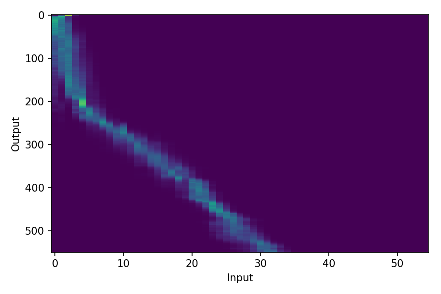 | "screamed the robber, running away as fast as he could. "   <audio src="blizzard17/train_no_dev_pytorch_train_pytorch_tacotron2.tuning.rev2/outputs_model.last1.avg.best_decode_denorm/dev/wav/TheMusiciansOfBremen_21_Track_21_000543-000889.wav" controls></audio>    | "screamed the robber, running away as fast as he could. "   <audio src="blizzard17/train_no_dev_pytorch_train_pytorch_tacotron2.tuning.rev3/outputs_model.last1.avg.best_decode_denorm/dev/wav/TheMusiciansOfBremen_21_Track_21_000543-000889.wav" controls></audio>    | "screamed the robber, running away as fast as he could. "   <audio src="blizzard17/train_no_dev_pytorch_train_pytorch_tacotron2.tuning.rev4/outputs_model.last1.avg.best_decode_denorm/dev/wav/TheMusiciansOfBremen_21_Track_21_000543-000889.wav" controls></audio>    | "screamed the robber, running away as fast as he could. "   <audio src="blizzard17/train_no_dev_pytorch_train_pytorch_tacotron2.tuning.rev5/outputs_model.last1.avg.best_decode_denorm/dev/wav/TheMusiciansOfBremen_21_Track_21_000543-000889.wav" controls></audio>    |  
| TheMusiciansOfBremen_21_Track_21_000543-000889 | "screamed the robber, running away as fast as he could. "   <audio src="blizzard17/train_no_dev_pytorch_train_pytorch_tacotron2.v3_4/outputs_model.last1.avg.best_decode_denorm/dev/wav/TheMusiciansOfBremen_21_Track_21_000543-000889.wav" controls></audio> | "screamed the robber, running away as fast as he could. "   <audio src="blizzard17/train_no_dev_pytorch_train_pytorch_tacotron2.v3_5/outputs_model.last1.avg.best_decode_denorm/dev/wav/TheMusiciansOfBremen_21_Track_21_000543-000889.wav" controls></audio> | "screeched the rooster, flying across the roof. "           <audio src="blizzard17/train_no_dev_pytorch_train_pytorch_tacotron2.v4/outputs_model.last1.avg.best_decode_denorm/dev/wav/TheMusiciansOfBremen_21_Track_21_000162-000471.wav" controls></audio>    | "screeched the rooster, flying across the roof. "           <audio src="blizzard17/train_no_dev_pytorch_train_pytorch_tacotron2.tuning.rev2/outputs_model.last1.avg.best_decode_denorm/dev/wav/TheMusiciansOfBremen_21_Track_21_000162-000471.wav" controls></audio>    | "screeched the rooster, flying across the roof. "           <audio src="blizzard17/train_no_dev_pytorch_train_pytorch_tacotron2.tuning.rev3/outputs_model.last1.avg.best_decode_denorm/dev/wav/TheMusiciansOfBremen_21_Track_21_000162-000471.wav" controls></audio>    | "screeched the rooster, flying across the roof. "           <audio src="blizzard17/train_no_dev_pytorch_train_pytorch_tacotron2.tuning.rev4/outputs_model.last1.avg.best_decode_denorm/dev/wav/TheMusiciansOfBremen_21_Track_21_000162-000471.wav" controls></audio>    | "screeched the rooster, flying across the roof. "           <audio src="blizzard17/train_no_dev_pytorch_train_pytorch_tacotron2.tuning.rev5/outputs_model.last1.avg.best_decode_denorm/dev/wav/TheMusiciansOfBremen_21_Track_21_000162-000471.wav" controls></audio>    |  
| TheMusiciansOfBremen_22_Track_22_000000-000309 | "there's a horrible witch in the house, he panted. "        <audio src="blizzard17/train_no_dev_pytorch_train_pytorch_tacotron2.v3_4/outputs_model.last1.avg.best_decode_denorm/dev/wav/TheMusiciansOfBremen_22_Track_22_000000-000309.wav" controls></audio> | "there's a horrible witch in the house, he panted. "        <audio src="blizzard17/train_no_dev_pytorch_train_pytorch_tacotron2.v3_5/outputs_model.last1.avg.best_decode_denorm/dev/wav/TheMusiciansOfBremen_22_Track_22_000000-000309.wav" controls></audio> | "there's a horrible witch in the house, he panted. "        <audio src="blizzard17/train_no_dev_pytorch_train_pytorch_tacotron2.v4/outputs_model.last1.avg.best_decode_denorm/dev/wav/TheMusiciansOfBremen_22_Track_22_000000-000309.wav" controls></audio>    | "there's a horrible witch in the house, he panted. "        <audio src="blizzard17/train_no_dev_pytorch_train_pytorch_tacotron2.tuning.rev2/outputs_model.last1.avg.best_decode_denorm/dev/wav/TheMusiciansOfBremen_22_Track_22_000000-000309.wav" controls></audio>    | "there's a horrible witch in the house, he panted. "        <audio src="blizzard17/train_no_dev_pytorch_train_pytorch_tacotron2.tuning.rev3/outputs_model.last1.avg.best_decode_denorm/dev/wav/TheMusiciansOfBremen_22_Track_22_000000-000309.wav" controls></audio>    | "there's a horrible witch in the house, he panted. "        <audio src="blizzard17/train_no_dev_pytorch_train_pytorch_tacotron2.tuning.rev4/outputs_model.last1.avg.best_decode_denorm/dev/wav/TheMusiciansOfBremen_22_Track_22_000000-000309.wav" controls></audio>    | "there's a horrible witch in the house, he panted. "        <audio src="blizzard17/train_no_dev_pytorch_train_pytorch_tacotron2.tuning.rev5/outputs_model.last1.avg.best_decode_denorm/dev/wav/TheMusiciansOfBremen_22_Track_22_000000-000309.wav" controls></audio>    |  
| TheMusiciansOfBremen_22_Track_22_000309-000578 | "she spat at me and scratched me. "                         <audio src="blizzard17/train_no_dev_pytorch_train_pytorch_tacotron2.v3_4/outputs_model.last1.avg.best_decode_denorm/dev/wav/TheMusiciansOfBremen_22_Track_22_000309-000578.wav" controls></audio> | "she spat at me and scratched me. "                         <audio src="blizzard17/train_no_dev_pytorch_train_pytorch_tacotron2.v3_5/outputs_model.last1.avg.best_decode_denorm/dev/wav/TheMusiciansOfBremen_22_Track_22_000309-000578.wav" controls></audio> | "she spat at me and scratched me. "                         <audio src="blizzard17/train_no_dev_pytorch_train_pytorch_tacotron2.v4/outputs_model.last1.avg.best_decode_denorm/dev/wav/TheMusiciansOfBremen_22_Track_22_000309-000578.wav" controls></audio>    | "she spat at me and scratched me. "                         <audio src="blizzard17/train_no_dev_pytorch_train_pytorch_tacotron2.tuning.rev2/outputs_model.last1.avg.best_decode_denorm/dev/wav/TheMusiciansOfBremen_22_Track_22_000309-000578.wav" controls></audio>    | "she spat at me and scratched me. "                         <audio src="blizzard17/train_no_dev_pytorch_train_pytorch_tacotron2.tuning.rev3/outputs_model.last1.avg.best_decode_denorm/dev/wav/TheMusiciansOfBremen_22_Track_22_000309-000578.wav" controls></audio>    | "she spat at me and scratched me. "                         <audio src="blizzard17/train_no_dev_pytorch_train_pytorch_tacotron2.tuning.rev4/outputs_model.last1.avg.best_decode_denorm/dev/wav/TheMusiciansOfBremen_22_Track_22_000309-000578.wav" controls></audio>    | "she spat at me and scratched me. "                         <audio src="blizzard17/train_no_dev_pytorch_train_pytorch_tacotron2.tuning.rev5/outputs_model.last1.avg.best_decode_denorm/dev/wav/TheMusiciansOfBremen_22_Track_22_000309-000578.wav" controls></audio>    |  
| TheMusiciansOfBremen_23_Track_23_000006-000257 | "there was a man with a knife by the door. "                <audio src="blizzard17/train_no_dev_pytorch_train_pytorch_tacotron2.v3_4/outputs_model.last1.avg.best_decode_denorm/dev/wav/TheMusiciansOfBremen_23_Track_23_000006-000257.wav" controls></audio> | "there was a man with a knife by the door. "                <audio src="blizzard17/train_no_dev_pytorch_train_pytorch_tacotron2.v3_5/outputs_model.last1.avg.best_decode_denorm/dev/wav/TheMusiciansOfBremen_23_Track_23_000006-000257.wav" controls></audio> | "there was a man with a knife by the door. "                <audio src="blizzard17/train_no_dev_pytorch_train_pytorch_tacotron2.v4/outputs_model.last1.avg.best_decode_denorm/dev/wav/TheMusiciansOfBremen_23_Track_23_000006-000257.wav" controls></audio>    | "there was a man with a knife by the door. "                <audio src="blizzard17/train_no_dev_pytorch_train_pytorch_tacotron2.tuning.rev2/outputs_model.last1.avg.best_decode_denorm/dev/wav/TheMusiciansOfBremen_23_Track_23_000006-000257.wav" controls></audio>    | "there was a man with a knife by the door. "                <audio src="blizzard17/train_no_dev_pytorch_train_pytorch_tacotron2.tuning.rev3/outputs_model.last1.avg.best_decode_denorm/dev/wav/TheMusiciansOfBremen_23_Track_23_000006-000257.wav" controls></audio>    | "there was a man with a knife by the door. "                <audio src="blizzard17/train_no_dev_pytorch_train_pytorch_tacotron2.tuning.rev4/outputs_model.last1.avg.best_decode_denorm/dev/wav/TheMusiciansOfBremen_23_Track_23_000006-000257.wav" controls></audio>    | "there was a man with a knife by the door. "                <audio src="blizzard17/train_no_dev_pytorch_train_pytorch_tacotron2.tuning.rev5/outputs_model.last1.avg.best_decode_denorm/dev/wav/TheMusiciansOfBremen_23_Track_23_000006-000257.wav" controls></audio>    |  

## lab3 file 
(lab file wiht punctuation & removed silence from head and tail of utterance)

### Training condition & attention_weight

| ID | **lab3-rev1** | **lab3-rev2** | 
| --- | --- | --- | 
| Label | new_lab | new_lab |  
| lr | 1e-4 | 1e-4 |  
| atype |  location | location |  
| use-guided-attn-loss | true | true |  
| guided-attn-loss-sigma | 0.4 | 0.4 |  
| reduction-factor | 2 | 3 |  
| batch-size | 16 | 16 |  
| Max_epoch | 100 | 100 |  
| Patience | 0 | 0 |  
| Best_epoch | - | - |  
| End_epoch | 100 | 100 |  
| 1st epoch |  | 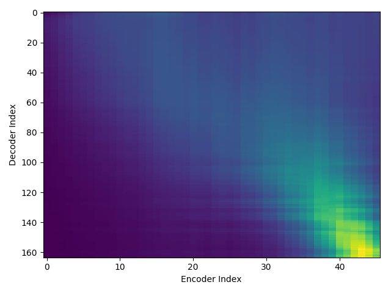 |   
| 2nd epoch |  | 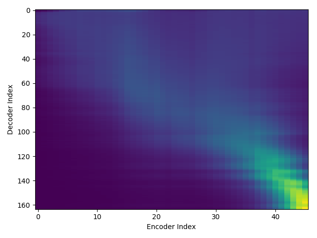 |   
| 3rd epoch |  | 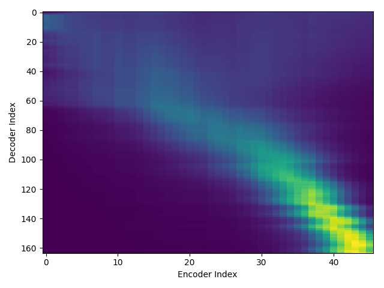 |   
| 4th epoch |  | 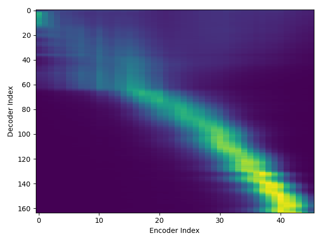 |   
| 5th epoch |  | 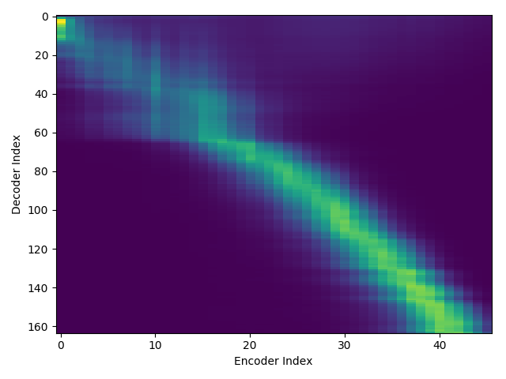 |   
| ... | ... | ... | 
| 100th epoch |  |  |  

### wav & attention_weight

| ID | **lab3-rev1** | **lab3-rev2** |  
| --- | --- | --- |  
| TheMusiciansOfBremen_21_Track_21_000185-000429 | "screeched the rooster, flying across the roof. "           <audio src="blizzard17/train_no_dev_pytorch_train_pytorch_tacotron2.tuning.lab3-rev1/outputs_model.last1.avg.best_decode_denorm/dev/wav/TheMusiciansOfBremen_21_Track_21_000185-000429.wav" controls></audio>    | "screeched the rooster, flying across the roof. "           <audio src="blizzard17/train_no_dev_pytorch_train_pytorch_tacotron2.tuning.lab3-rev2/outputs_model.last1.avg.best_decode_denorm/dev/wav/TheMusiciansOfBremen_21_Track_21_000185-000429.wav" controls></audio>   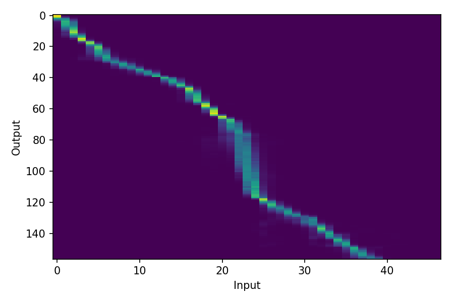 |   
| TheMusiciansOfBremen_21_Track_21_000568-000854 | "screamed the robber, running away as fast as he could. "   <audio src="blizzard17/train_no_dev_pytorch_train_pytorch_tacotron2.tuning.lab3-rev1/outputs_model.last1.avg.best_decode_denorm/dev/wav/TheMusiciansOfBremen_21_Track_21_000568-000854.wav" controls></audio>    | "screamed the robber, running away as fast as he could. "   <audio src="blizzard17/train_no_dev_pytorch_train_pytorch_tacotron2.tuning.lab3-rev2/outputs_model.last1.avg.best_decode_denorm/dev/wav/TheMusiciansOfBremen_21_Track_21_000568-000854.wav" controls></audio>    |   
| TheMusiciansOfBremen_22_Track_22_000025-000301 | "there's a horrible witch in the house, he panted. "        <audio src="blizzard17/train_no_dev_pytorch_train_pytorch_tacotron2.tuning.lab3-rev1/outputs_model.last1.avg.best_decode_denorm/dev/wav/TheMusiciansOfBremen_22_Track_22_000025-000301.wav" controls></audio>    | "there's a horrible witch in the house, he panted. "        <audio src="blizzard17/train_no_dev_pytorch_train_pytorch_tacotron2.tuning.lab3-rev2/outputs_model.last1.avg.best_decode_denorm/dev/wav/TheMusiciansOfBremen_22_Track_22_000025-000301.wav" controls></audio>   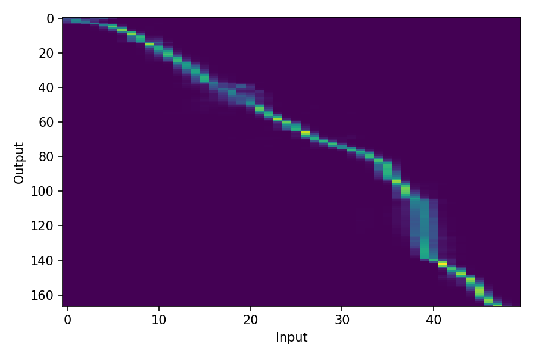 |   
| TheMusiciansOfBremen_22_Track_22_000315-000543 | "she spat at me and scratched me. "                         <audio src="blizzard17/train_no_dev_pytorch_train_pytorch_tacotron2.tuning.lab3-rev1/outputs_model.last1.avg.best_decode_denorm/dev/wav/TheMusiciansOfBremen_22_Track_22_000315-000543.wav" controls></audio>    | "she spat at me and scratched me. "                         <audio src="blizzard17/train_no_dev_pytorch_train_pytorch_tacotron2.tuning.lab3-rev2/outputs_model.last1.avg.best_decode_denorm/dev/wav/TheMusiciansOfBremen_22_Track_22_000315-000543.wav" controls></audio>   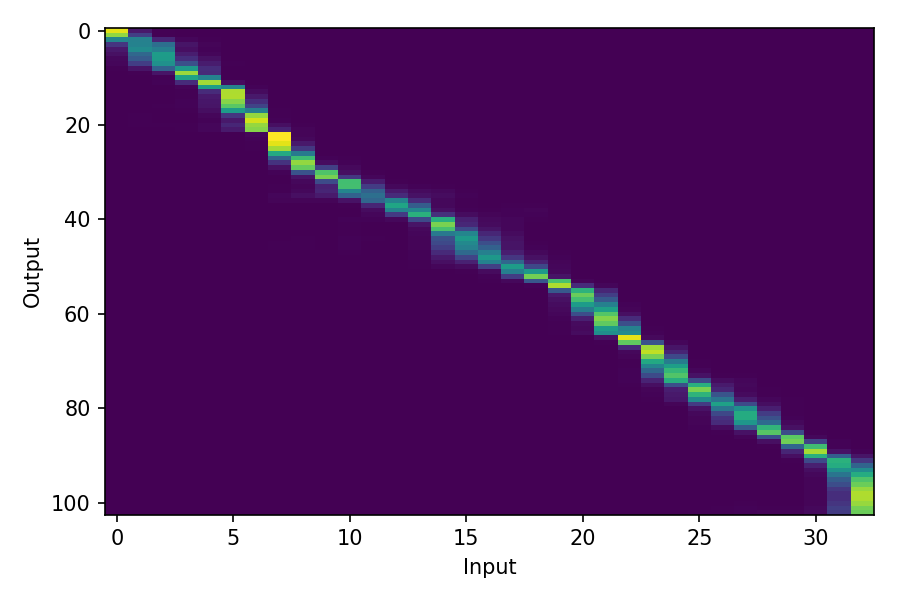 |   
| TheMusiciansOfBremen_23_Track_23_000037-000234 | "there was a man with a knife by the door. "                <audio src="blizzard17/train_no_dev_pytorch_train_pytorch_tacotron2.tuning.lab3-rev1/outputs_model.last1.avg.best_decode_denorm/dev/wav/TheMusiciansOfBremen_23_Track_23_000037-000234.wav" controls></audio>    | "there was a man with a knife by the door. "                <audio src="blizzard17/train_no_dev_pytorch_train_pytorch_tacotron2.tuning.lab3-rev2/outputs_model.last1.avg.best_decode_denorm/dev/wav/TheMusiciansOfBremen_23_Track_23_000037-000234.wav" controls></audio>    |   

<!--
TheMusiciansOfBremen_21_Track_21_000185-000429 screeched the rooster, flying across the roof. 
TheMusiciansOfBremen_21_Track_21_000568-000854 screamed the robber, running away as fast as he could. 
TheMusiciansOfBremen_22_Track_22_000025-000301 there's a horrible witch in the house, he panted. 
TheMusiciansOfBremen_22_Track_22_000315-000543 she spat at me and scratched me. 
TheMusiciansOfBremen_23_Track_23_000037-000234 there was a man with a knife by the door. 
TheMusiciansOfBremen_23_Track_23_000294-000436 he stabbed me in the leg. 
TheMusiciansOfBremen_23_Track_23_000541-000759 in the yard there's a big, black monster. 
TheMusiciansOfBremen_23_Track_23_000808-000945 he beat me with his club. 
TheMusiciansOfBremen_24_Track_24_000025-000262 the robbers never went back to the house again. 
TheMusiciansOfBremen_24_Track_24_000380-000733 as for the four friends, they never did go to bremen. 
--->
