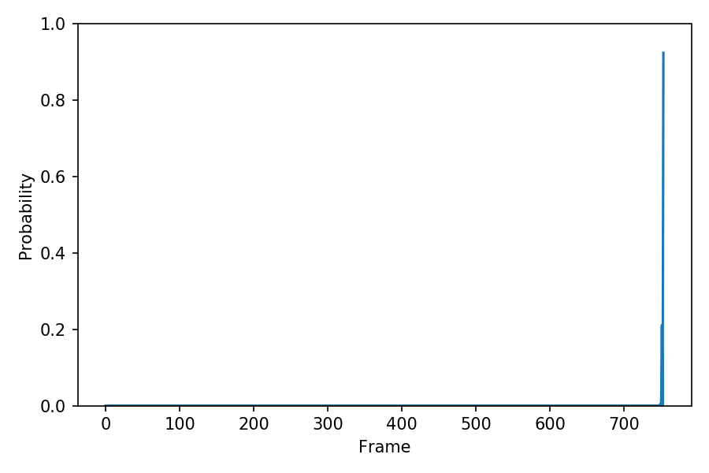

# demo190911

## speaker 1089  

### Training condition & attention_weight

| ID | **0th decode** | **rev1** | **rev2** |  
| --- | --- | --- | --- |  
| transformer-lr | 1.0 | 1.0 | 0.1 |  
| reduction-factor | 2 | 2 | 2 |  
| epochs | 100 | 10 | 10 |  
| patience | 0 | 0 | 0 |  
| Best_epoch | - | - | - |  
| End_epoch | 100 | 10 | 10 |  
| all_loss      | - |         |         |  
| loss          | - |             |             |  
| l1_loss       | - |          |          |  
| l2_loss       | - |          |          |  
| bce_loss      | - |         |         |  
| encoder_alpha | - |    |    |  
| decoder_alpha | - |    |    |  

### 1089_134691_000043_000000  
 "Where was his boyhood now?"  

| ground_truth | **0th decode** | **rev1** | **rev2** |  
| --- | --- | --- | --- |  
| <audio src="libritts_asrtts_offline/ground_truth/eval/wav/1089_134691_000043_000000.wav" controls></audio> | <audio src="libritts_asrtts_offline/sample_rev2_train_pytorch_tts_train_pytorch_transformer.fine-tuning.rev0/eval/wav/1089_134691_000043_000000.wav" controls></audio>       | <audio src="libritts_asrtts_offline/sample_rev2_train_pytorch_tts_train_pytorch_transformer.fine-tuning.rev1/eval/wav/1089_134691_000043_000000.wav" controls></audio>        | <audio src="libritts_asrtts_offline/sample_rev2_train_pytorch_tts_train_pytorch_transformer.fine-tuning.rev2/eval/wav/1089_134691_000043_000000.wav" controls></audio>        |   
|                                                                                                            |   |    |    |   
|                                                                                                            |      |       |       |   

### 1089_134691_000044_000001  
"He was unheeded, happy and near to the wild heart of life."  

| ground_truth | **0th decode** | **rev1** | **rev2** |  
| --- | --- | --- | --- |  
| <audio src="libritts_asrtts_offline/ground_truth/eval/wav/1089_134691_000044_000001.wav" controls></audio> | <audio src="libritts_asrtts_offline/sample_rev2_train_pytorch_tts_train_pytorch_transformer.fine-tuning.rev0/eval/wav/1089_134691_000044_000001.wav" controls></audio>       | <audio src="libritts_asrtts_offline/sample_rev2_train_pytorch_tts_train_pytorch_transformer.fine-tuning.rev1/eval/wav/1089_134691_000044_000001.wav" controls></audio>        | <audio src="libritts_asrtts_offline/sample_rev2_train_pytorch_tts_train_pytorch_transformer.fine-tuning.rev2/eval/wav/1089_134691_000044_000001.wav" controls></audio>        |   
|                                                                                                            |   |    |    |   
|                                                                                                            |      |       |       |   

### 1089_134691_000045_000003  
"Her thighs, fuller and soft hued as ivory, were bared almost to the hips, where the white fringes of her drawers were like feathering of soft white down."  

| ground_truth | **0th decode** | **rev1** | **rev2** |  
| --- | --- | --- | --- |  
| <audio src="libritts_asrtts_offline/ground_truth/eval/wav/1089_134691_000045_000003.wav" controls></audio> | <audio src="libritts_asrtts_offline/sample_rev2_train_pytorch_tts_train_pytorch_transformer.fine-tuning.rev0/eval/wav/1089_134691_000045_000003.wav" controls></audio>       | <audio src="libritts_asrtts_offline/sample_rev2_train_pytorch_tts_train_pytorch_transformer.fine-tuning.rev1/eval/wav/1089_134691_000045_000003.wav" controls></audio>        | <audio src="libritts_asrtts_offline/sample_rev2_train_pytorch_tts_train_pytorch_transformer.fine-tuning.rev2/eval/wav/1089_134691_000045_000003.wav" controls></audio>        |   
|                                                                                                            |   |    |    |   
|                                                                                                            |      |       |       |   

### 1089_134691_000045_000004  
"Her slate blue skirts were kilted boldly about her waist and dovetailed behind her."  

| ground_truth | **0th decode** | **rev1** | **rev2** |  
| --- | --- | --- | --- |  
| <audio src="libritts_asrtts_offline/ground_truth/eval/wav/1089_134691_000045_000004.wav" controls></audio> | <audio src="libritts_asrtts_offline/sample_rev2_train_pytorch_tts_train_pytorch_transformer.fine-tuning.rev0/eval/wav/1089_134691_000045_000004.wav" controls></audio>       | <audio src="libritts_asrtts_offline/sample_rev2_train_pytorch_tts_train_pytorch_transformer.fine-tuning.rev1/eval/wav/1089_134691_000045_000004.wav" controls></audio>         | <audio src="libritts_asrtts_offline/sample_rev2_train_pytorch_tts_train_pytorch_transformer.fine-tuning.rev2/eval/wav/1089_134691_000045_000004.wav" controls></audio>         |   
|                                                                                                            |   |     |     |   
|                                                                                                            |      |        |        |   

### 1089_134691_000045_000005  
"Her bosom was as a bird's, soft and slight, slight and soft as the breast of some dark plumaged dove."   

| ground_truth | **0th decode** | **rev1** | **rev2** | 
| --- | --- | --- | --- |  
| <audio src="libritts_asrtts_offline/ground_truth/eval/wav/1089_134691_000045_000005.wav" controls></audio> | <audio src="libritts_asrtts_offline/sample_rev2_train_pytorch_tts_train_pytorch_transformer.fine-tuning.rev0/eval/wav/1089_134691_000045_000005.wav" controls></audio>       | <audio src="libritts_asrtts_offline/sample_rev2_train_pytorch_tts_train_pytorch_transformer.fine-tuning.rev1/eval/wav/1089_134691_000045_000005.wav" controls></audio>        | <audio src="libritts_asrtts_offline/sample_rev2_train_pytorch_tts_train_pytorch_transformer.fine-tuning.rev2/eval/wav/1089_134691_000045_000005.wav" controls></audio>        |   
|                                                                                                            |   |    |    |   
|                                                                                                            |      |       |       |   

