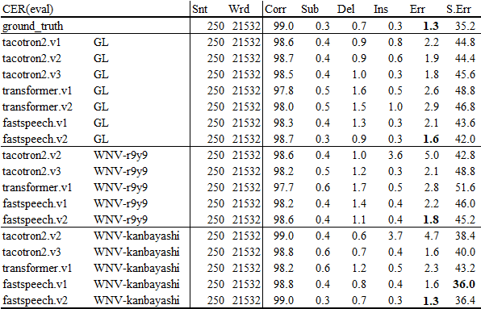
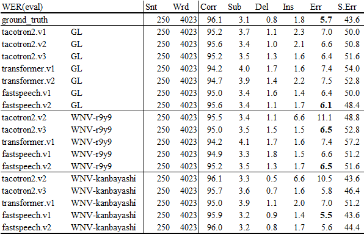

# demo190924

## Insertion error

### tacotron2.v1

<audio src="exp/train_no_dev_pytorch_train_pytorch_tacotron2.v1/eval/wav/LJ050-0063.wav" controls></audio>  

#### wav(LJ050_0063)

    id: (lj050_0063)
    Scores: (#C #S #D #I) 19 1 0 11
    REF:  and who have been involved in bombing or bomb making or whose past conduct indicates tendencies toward violence *** **** *** **** *** *** and ********** ** *** **** *** D   
    HYP:  and who have been involved in bombing or bomb making or whose past conduct indicates tendencies toward violence AND THEN THE DEAD AND BAD and ABOMINABLE OF ALL THEN I'M BAD 
    Eval:                                                                                                                 I   I    I   I    I   I       I          I  I   I    I   S   

#### wav(LJ050_0179)

<audio src="exp/train_no_dev_pytorch_train_pytorch_tacotron2.v1/eval/wav/LJ050-0179.wav" controls></audio>  

    id: (lj050_0179)
    Scores: (#C #S #D #I) 19 1 0 13
    REF:  based on its experience during this period the secret service now recommends that additional personnel be made available to ****** ****** ***** **** ** ****** ** ****** *** * ****** **** ** PRS  
    HYP:  based on its experience during this period the secret service now recommends that additional personnel be made available to PIERCE VERSUS LEVEE VERS DE L'EPEE DE L'EVIE BUT A LITTLE NAVY OF ZOLI 
    Eval:                                                                                                                             I      I      I     I    I  I      I  I      I   I I      I    I  S    

### tacotron2.v2

#### wav(LJ050_0063)

<audio src="exp/train_no_dev_pytorch_train_pytorch_tacotron2.v2/eval/wav/LJ050-0063.wav" controls></audio>  

    id: (lj050_0063)  
    Scores: (#C #S #D #I) 19 1 0 17  
    REF:  and who have been involved in bombing or bomb making or whose past conduct indicates tendencies toward violence *** and *** *** **** *** *** **** **** **** **** ** **** ** ***** ** ******* ** D         
    HYP:  and who have been involved in bombing or bomb making or whose past conduct indicates tendencies toward violence AND and DID THE DEED DID THE DEED DEED DEED DEED TO DEED IT DAVED IN BOMBING OR BOMBING   
    Eval:                                                                                                                 I       I   I   I    I   I   I    I    I    I    I  I    I  I     I  I       I  S         

#### wav_wnv_mol (r9y9)

<audio src="exp/train_no_dev_pytorch_train_pytorch_tacotron2.v2/eval/wav_wnv_mol/LJ050-0063.wav" controls></audio>  

    id: (lj050_0063)  
    Scores: (#C #S #D #I) 19 1 0 206  
    REF:  and who have been involved in bombing or bomb making or whose past conduct indicates tendencies toward violence and ** *** ***** ** ***** ** ***** ** *** ***** ** ***** ** ***** ** ***** ** ***** ** ***** ** ***** ** ***** ** ***** ** ***** ** ***** ** ***** ** ***** ** ***** ** ***** ** ***** ** ***** ** ***** ** ***** ** ***** ** ***** ** ***** ** ***** ** ***** ** ***** ** ***** ** ***** ** ***** ** ***** ** ***** ** ***** ** ***** ** ***** ** ***** ** ***** ** ***** ** ***** ** ***** ** ***** ** ***** ** ***** ** ***** ** ***** ** ***** ** ***** ** ***** ** ***** ** ***** ** ***** ** ***** ** ***** ** ***** ** ***** ** ***** ** ***** ** ***** ** ***** ** ***** ** ***** ** ***** ** ***** ** ***** ** ***** ** ***** ** ***** ** ***** ** ***** ** ***** ** ***** ** ***** ** ***** ** ***** ** ***** ** ***** ** ***** ** ***** ** ***** ** ***** ** ***** ** ***** ** ***** ** ***** ** ***** ** ***** ** ***** ** ***** ** ***** ** ***** ** ***** ** ***** ** ***** ** ***** ** ***** **   
    HYP:  and who have been involved in bombing or bomb making or whose past conduct indicates tendencies toward violence and TO THE DEITY TO DEITY TO DEITY TO THE DEITY TO DEITY TO DEITY TO DEITY TO DEITY TO DEITY TO DEITY TO DEITY TO DEITY TO DEITY TO DEITY TO DEITY TO DEITY TO DEITY TO DEITY TO DEITY TO DEITY TO DEITY TO DEITY TO DEITY TO DEITY TO DEITY TO DEITY TO DEITY TO DEITY TO DEITY TO DEITY TO DEITY TO DEITY TO DEITY TO DEITY TO DEITY TO DEITY TO DEITY TO DEITY TO DEITY TO DEITY TO DEITY TO DEITY TO DEITY TO DEITY TO DEITY TO DEITY TO DEITY TO DEITY TO DEITY TO DEITY TO DEITY TO DEITY TO DEITY TO DEITY TO DEITY TO DEITY TO DEITY TO DEITY TO DEITY TO DEITY TO DEITY TO DEITY TO DEITY TO DEITY TO DEITY TO DEITY TO DEITY TO DEITY TO DEITY TO DEITY TO DEITY TO DEITY TO DEITY TO DEITY TO DEITY TO DEITY TO DEITY TO DEITY TO DEITY TO DEITY TO DEITY TO DEITY TO DEITY TO DEITY TO DEITY TO DEITY TO DEITY TO DEITY TO DEITY TO DEITY TO DEITY TO DEITY TO DEITY TO DEITY TO DEITY TO DEITY TO   
    Eval:                                                                                                                     I  I   I     I  I     I  I     I  I   I     I  I     I  I     I  I     I  I     I  I     I  I     I  I     I  I     I  I     I  I     I  I     I  I     I  I     I  I     I  I     I  I     I  I     I  I     I  I     I  I     I  I     I  I     I  I     I  I     I  I     I  I     I  I     I  I     I  I     I  I     I  I     I  I     I  I     I  I     I  I     I  I     I  I     I  I     I  I     I  I     I  I     I  I     I  I     I  I     I  I     I  I     I  I     I  I     I  I     I  I     I  I     I  I     I  I     I  I     I  I     I  I     I  I     I  I     I  I     I  I     I  I     I  I     I  I     I  I     I  I     I  I     I  I     I  I     I  I     I  I     I  I     I  I     I  I     I  I     I  I     I  I     I  I     I  I     I  I     I  I     I  I     I  I     I  I     I  I     I  I     I  I     I  I     I  I     I  I     I  I     I  I     I  I     I    

#### wav_wnv_nsf (kan-bayashi)

<audio src="exp/train_no_dev_pytorch_train_pytorch_tacotron2.v2/eval/wav_wnv_nsf/LJ050-0063.wav" controls></audio>  

    id: (lj050_0063)  
    Scores: (#C #S #D #I) 19 1 0 207  
    REF:  and who have been involved in bombing or bomb making or whose past conduct indicates tendencies toward violence and ** *** ***** ** ***** ** ***** ** ***** ** ***** ** ***** ** *** ***** ** ***** ** ***** ** ***** ** ***** ** ***** ** ***** ** ***** ** ***** ** ***** ** ***** ** ***** ** ***** ** ***** ** ***** ** ***** ** ***** ** ***** ** ***** ** ***** ** ***** ** ***** ** ***** ** ***** ** ***** ** ***** ** ***** ** ***** ** ***** ** ***** ** ***** ** ***** ** ***** ** ***** ** ***** ** ***** ** ***** ** ***** ** ***** ** ***** ** ***** ** ***** ** ***** ** ***** ** ***** ** ***** ** ***** ** ***** ** ***** ** ***** ** ***** ** ***** ** ***** ** ***** ** ***** ** ***** ** ***** ** ***** ** ***** ** ***** ** ***** ** ***** ** ***** ** ***** ** ***** ** ***** ** ***** ** ***** ** ***** ** ***** ** ***** ** ***** ** ***** ** ***** ** ***** ** ***** ** ***** ** ***** ** ***** ** ***** ** ***** ** ***** ** ***** ** ***** ** ***** ** ***** ** ***** ** ***** ** ***** ** ***** **   
    HYP:  and who have been involved in bombing or bomb making or whose past conduct indicates tendencies toward violence and TO THE DEITY TO DEITY TO DEITY TO DEITY TO DEITY TO DEITY TO THE DEITY TO DEITY TO DEITY TO DEITY TO DEITY TO DEITY TO DEITY TO DEITY TO DEITY TO DEITY TO DEITY TO DEITY TO DEITY TO DEITY TO DEITY TO DEITY TO DEITY TO DEITY TO DEITY TO DEITY TO DEITY TO DEITY TO DEITY TO DEITY TO DEITY TO DEITY TO DEITY TO DEITY TO DEITY TO DEITY TO DEITY TO DEITY TO DEITY TO DEITY TO DEITY TO DEITY TO DEITY TO DEITY TO DEITY TO DEITY TO DEITY TO DEITY TO DEITY TO DEITY TO DEITY TO DEITY TO DEITY TO DEITY TO DEITY TO DEITY TO DEITY TO DEITY TO DEITY TO DEITY TO DEITY TO DEITY TO DEITY TO DEITY TO DEITY TO DEITY TO DEITY TO DEITY TO DEITY TO DEITY TO DEITY TO DEITY TO DEITY TO DEITY TO DEITY TO DEITY TO DEITY TO DEITY TO DEITY TO DEITY TO DEITY TO DEITY TO DEITY TO DEITY TO DEITY TO DEITY TO DEITY TO DEITY TO DEITY TO DEITY TO DEITY TO DEITY TO DEITY TO DEITY TO DEITY TO DEITY TO   
    Eval:                                                                                                                     I  I   I     I  I     I  I     I  I     I  I     I  I     I  I   I     I  I     I  I     I  I     I  I     I  I     I  I     I  I     I  I     I  I     I  I     I  I     I  I     I  I     I  I     I  I     I  I     I  I     I  I     I  I     I  I     I  I     I  I     I  I     I  I     I  I     I  I     I  I     I  I     I  I     I  I     I  I     I  I     I  I     I  I     I  I     I  I     I  I     I  I     I  I     I  I     I  I     I  I     I  I     I  I     I  I     I  I     I  I     I  I     I  I     I  I     I  I     I  I     I  I     I  I     I  I     I  I     I  I     I  I     I  I     I  I     I  I     I  I     I  I     I  I     I  I     I  I     I  I     I  I     I  I     I  I     I  I     I  I     I  I     I  I     I  I     I  I     I  I     I  I     I  I     I  I     I  I     I  I     I  I     I  I     I  I     I  I     I  I     I  I     I  I     I    

#### wav(LJ050_0179)

<audio src="exp/train_no_dev_pytorch_train_pytorch_tacotron2.v2/eval/wav/LJ050-0179.wav" controls></audio>  

    id: (lj050_0179)
    Scores: (#C #S #D #I) 19 1 0 1
    REF:  based on its experience during this period the secret service now recommends that additional personnel be made available to * PRS 
    HYP:  based on its experience during this period the secret service now recommends that additional personnel be made available to P S   
    Eval:                                                                                                                             I S   

### tacotron2.v3

<audio src="exp/train_no_dev_pytorch_train_pytorch_tacotron2.v3/eval/wav/LJ050-0063.wav" controls></audio>  

#### wav(LJ050_0063)

    id: (lj050_0063)
    Scores: (#C #S #D #I) 18 1 1 1
    REF:  AND who have been involved in bombing or bomb making or whose past conduct indicates tendencies toward violence and *** D  
    HYP:  *** who have been involved in bombing or bomb making or whose past conduct indicates tendencies toward violence and DID IT 
    Eval: D                                                                                                                   I   S  

#### wav(LJ050_0179)

<audio src="exp/train_no_dev_pytorch_train_pytorch_tacotron2.v3/eval/wav/LJ050-0179.wav" controls></audio>  

    id: (lj050_0179)
    Scores: (#C #S #D #I) 19 1 0 1
    REF:  based on its experience during this period the secret service now recommends that additional personnel be made available to * PRS 
    HYP:  based on its experience during this period the secret service now recommends that additional personnel be made available to P S   
    Eval:                                                                                                                             I S   

### transfprmer.v2

#### wav(LJ050_0241)

<audio src="exp/train_no_dev_pytorch_train_pytorch_tacotron2.v3/eval/wav/LJ050-0241.wav" controls></audio>  

    id: (lj050_0241)
    Scores: (#C #S #D #I) 13 1 1 11
    REF:  the * * FBI has indicated that IT is willing to continue to make such assistance ********* ********* **** ** ** ******* ** **** ** available 
    HYP:  the F B I   has indicated that ** is willing to continue to make such assistance AVAILABLE AVAILABLE THAT IT IS WILLING TO KEEP IT available 
    Eval:     I I S                      D                                                 I         I         I    I  I  I       I  I    I            

#### wav(LJ050_0268)

<audio src="exp/train_no_dev_pytorch_train_pytorch_tacotron2.v3/eval/wav/LJ050-0268.wav" controls></audio>  

    id: (lj050_0268)
    Scores: (#C #S #D #I) 25 0 3 5
    REF:  the service should negotiate a memorandum of understanding WITH EACH AGENCY that has been assisting ** *** **** ***** it *** and from which it can expect to need help in the future 
    HYP:  the service should negotiate a memorandum of understanding **** **** ****** that has been assisting IT AND FROM WHICH it CAN and from which it can expect to need help in the future 
    Eval:                                                            D    D    D                              I  I   I    I        I                                                           

### transfprmer.v1

#### wav(LJ050_0241)

<audio src="exp/train_no_dev_pytorch_train_pytorch_tacotron2.v3/eval/wav/LJ050-0241.wav" controls></audio>  

    id: (lj050_0241)
    Scores: (#C #S #D #I) 13 2 0 1
    REF:  * THE FBI has indicated that it is willing to continue to make such assistance available 
    HYP:  F B   I   has indicated that it is willing to continue to make such assistance available 
    Eval: I S   S                                                                                  

#### wav(LJ050_0268)

<audio src="exp/train_no_dev_pytorch_train_pytorch_tacotron2.v3/eval/wav/LJ050-0268.wav" controls></audio>  

    id: (lj050_0268)
    Scores: (#C #S #D #I) 27 1 0 0
    REF:  THE service should negotiate a memorandum of understanding with each agency that has been assisting it and from which it can expect to need help in the future 
    HYP:  A   service should negotiate a memorandum of understanding with each agency that has been assisting it and from which it can expect to need help in the future 
    Eval: S                                                                                                                                                              

