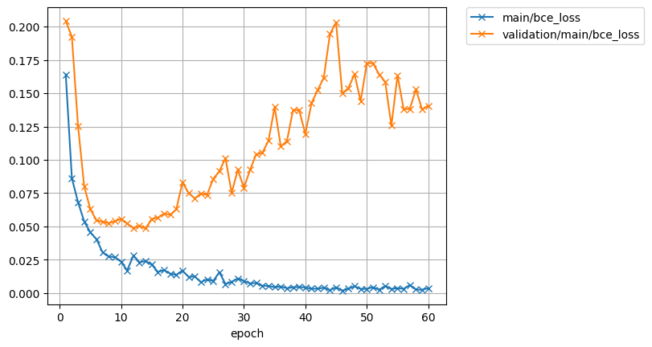
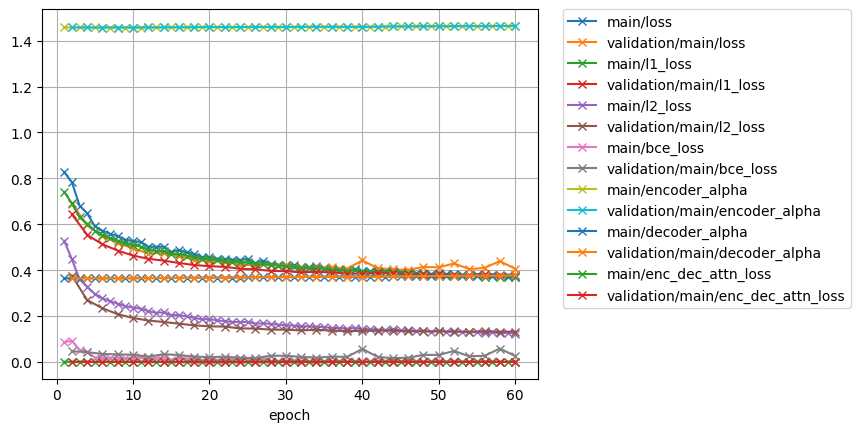
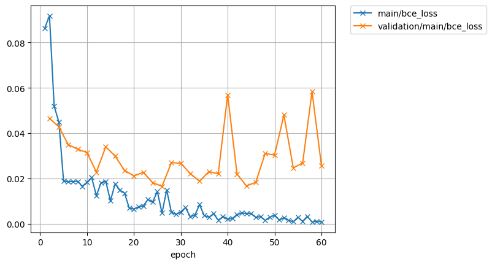
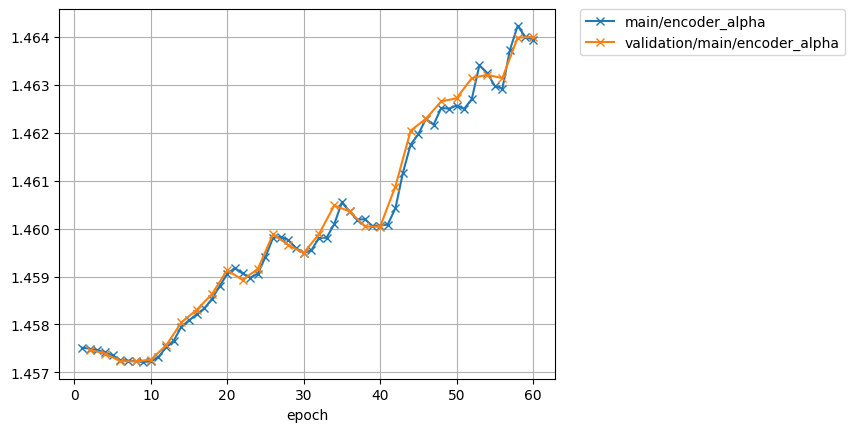
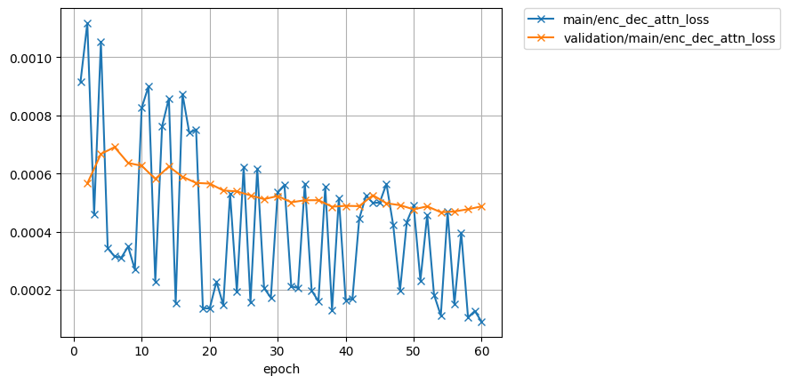

# Speaker adaptation for single speaker tts model

model: ljspeech.transformer.v1
text: ASR output
speech: speech of target speaker

## 237(F)

target for pre-train  
<audio src="ljspeech_asrtts_offline/ljspeech.ground_truth/eval/wav/LJ050-0029.wav" controls></audio>  

237_134500_000036_000000.wav  

| type | wav |  
| --- | --- |  
| target for fine-tuning    | <audio src="ljspeech_asrtts_offline/test_clean_22050_237.ground_truth/eval/wav/237_134500_000036_000000.wav" controls></audio> |  
| 0th decode                | <audio src="ljspeech_asrtts_offline/test_clean_22050_237_train_no_dev_pytorch_tts_train_pytorch_transformer.fine-tuning.spk237_lr1.rev1/eval_0th/wav/237_134500_000036_000000.wav" controls></audio> |  
| loss.best (47  epoch)     | <audio src="ljspeech_asrtts_offline/test_clean_22050_237_train_no_dev_pytorch_tts_train_pytorch_transformer.fine-tuning.spk237_lr1.rev1/eval_loss.best/wav/237_134500_000036_000000.wav" controls></audio> |  
| avg.best  (100  epoch)    | <audio src="ljspeech_asrtts_offline/test_clean_22050_237_train_no_dev_pytorch_tts_train_pytorch_transformer.fine-tuning.spk237_lr1.rev1/eval_avg.best/wav/237_134500_000036_000000.wav" controls></audio> |  

237_134500_000036_000001.wav  

| type | wav |  
| --- | --- |  
| target for fine-tuning    | <audio src="ljspeech_asrtts_offline/test_clean_22050_237.ground_truth/eval/wav/237_134500_000036_000001.wav" controls></audio> |  
| 0th decode                | <audio src="ljspeech_asrtts_offline/test_clean_22050_237_train_no_dev_pytorch_tts_train_pytorch_transformer.fine-tuning.spk237_lr1.rev1/eval_0th/wav/237_134500_000036_000001.wav" controls></audio> |  
| loss.best (47 epoch)      | <audio src="ljspeech_asrtts_offline/test_clean_22050_237_train_no_dev_pytorch_tts_train_pytorch_transformer.fine-tuning.spk237_lr1.rev1/eval_loss.best/wav/237_134500_000036_000001.wav" controls></audio> |  
| avg.best  (100 epoch)     | <audio src="ljspeech_asrtts_offline/test_clean_22050_237_train_no_dev_pytorch_tts_train_pytorch_transformer.fine-tuning.spk237_lr1.rev1/eval_avg.best/wav/237_134500_000036_000001.wav" controls></audio> |  

237_134500_000036_000002.wav  

| type | wav |  
| --- | --- |  
| target for fine-tuning    | <audio src="ljspeech_asrtts_offline/test_clean_22050_237.ground_truth/eval/wav/237_134500_000036_000002.wav" controls></audio> |  
| 0th decode                | <audio src="ljspeech_asrtts_offline/test_clean_22050_237_train_no_dev_pytorch_tts_train_pytorch_transformer.fine-tuning.spk237_lr1.rev1/eval_0th/wav/237_134500_000036_000002.wav" controls></audio> |  
| loss.best (47 epoch)      | <audio src="ljspeech_asrtts_offline/test_clean_22050_237_train_no_dev_pytorch_tts_train_pytorch_transformer.fine-tuning.spk237_lr1.rev1/eval_loss.best/wav/237_134500_000036_000002.wav" controls></audio> |  
| avg.best  (100 epoch)     | <audio src="ljspeech_asrtts_offline/test_clean_22050_237_train_no_dev_pytorch_tts_train_pytorch_transformer.fine-tuning.spk237_lr1.rev1/eval_avg.best/wav/237_134500_000036_000002.wav" controls></audio> |  

237_134500_000036_000003.wav  

| type | wav |  
| --- | --- |  
| target for fine-tuning    | <audio src="ljspeech_asrtts_offline/test_clean_22050_237.ground_truth/eval/wav/237_134500_000036_000003.wav" controls></audio> |  
| 0th decode                | <audio src="ljspeech_asrtts_offline/test_clean_22050_237_train_no_dev_pytorch_tts_train_pytorch_transformer.fine-tuning.spk237_lr1.rev1/eval_0th/wav/237_134500_000036_000003.wav" controls></audio> |  
| loss.best (47 epoch)      | <audio src="ljspeech_asrtts_offline/test_clean_22050_237_train_no_dev_pytorch_tts_train_pytorch_transformer.fine-tuning.spk237_lr1.rev1/eval_loss.best/wav/237_134500_000036_000003.wav" controls></audio> |  
| avg.best  (100 epoch)     | <audio src="ljspeech_asrtts_offline/test_clean_22050_237_train_no_dev_pytorch_tts_train_pytorch_transformer.fine-tuning.spk237_lr1.rev1/eval_avg.best/wav/237_134500_000036_000003.wav" controls></audio> |  

237_134500_000036_000004.wav  

| type | wav |  
| --- | --- |  
| target for fine-tuning    | <audio src="ljspeech_asrtts_offline/test_clean_22050_237.ground_truth/eval/wav/237_134500_000036_000004.wav" controls></audio> |  
| 0th decode                | <audio src="ljspeech_asrtts_offline/test_clean_22050_237_train_no_dev_pytorch_tts_train_pytorch_transformer.fine-tuning.spk237_lr1.rev1/eval_0th/wav/237_134500_000036_000004.wav" controls></audio> |  
| loss.best (47 epoch)      | <audio src="ljspeech_asrtts_offline/test_clean_22050_237_train_no_dev_pytorch_tts_train_pytorch_transformer.fine-tuning.spk237_lr1.rev1/eval_loss.best/wav/237_134500_000036_000004.wav" controls></audio> |  
| avg.best  (100 epoch)     | <audio src="ljspeech_asrtts_offline/test_clean_22050_237_train_no_dev_pytorch_tts_train_pytorch_transformer.fine-tuning.spk237_lr1.rev1/eval_avg.best/wav/237_134500_000036_000004.wav" controls></audio> |  

## 4446(F)

target for pre-train  
<audio src="ljspeech_asrtts_offline/ljspeech.ground_truth/eval/wav/LJ050-0029.wav" controls></audio>  

4446_2275_000044_000005.wav  

| type | wav |  
| --- | --- |  
| target for fine-tuning    | <audio src="ljspeech_asrtts_offline/test_clean_22050_4446.ground_truth/eval/wav/4446_2275_000044_000005.wav" controls></audio> |  
| 0th decode                | <audio src="ljspeech_asrtts_offline/test_clean_22050_4446_train_no_dev_pytorch_tts_train_pytorch_transformer.fine-tuning.spk4446_lr1.rev1/eval_0th/wav/4446_2275_000044_000005.wav" controls></audio> |  
| loss.best (18 epoch)      | <audio src="ljspeech_asrtts_offline/test_clean_22050_4446_train_no_dev_pytorch_tts_train_pytorch_transformer.fine-tuning.spk4446_lr1.rev1/eval_loss.best/wav/4446_2275_000044_000005.wav" controls></audio> |  
| avg.best  (60 epoch)      | <audio src="ljspeech_asrtts_offline/test_clean_22050_4446_train_no_dev_pytorch_tts_train_pytorch_transformer.fine-tuning.spk4446_lr1.rev1/eval_avg.best/wav/4446_2275_000044_000005.wav" controls></audio> |  

4446_2275_000044_000006.wav  

| type | wav |  
| --- | --- |  
| target for fine-tuning    | <audio src="ljspeech_asrtts_offline/test_clean_22050_4446.ground_truth/eval/wav/4446_2275_000044_000006.wav" controls></audio> |  
| 0th decode                | <audio src="ljspeech_asrtts_offline/test_clean_22050_4446_train_no_dev_pytorch_tts_train_pytorch_transformer.fine-tuning.spk4446_lr1.rev1/eval_0th/wav/4446_2275_000044_000006.wav" controls></audio> |  
| loss.best (18 epoch)      | <audio src="ljspeech_asrtts_offline/test_clean_22050_4446_train_no_dev_pytorch_tts_train_pytorch_transformer.fine-tuning.spk4446_lr1.rev1/eval_loss.best/wav/4446_2275_000044_000006.wav" controls></audio> |  
| avg.best  (60 epoch)      | <audio src="ljspeech_asrtts_offline/test_clean_22050_4446_train_no_dev_pytorch_tts_train_pytorch_transformer.fine-tuning.spk4446_lr1.rev1/eval_avg.best/wav/4446_2275_000044_000006.wav" controls></audio> |  

4446_2275_000045_000000.wav  

| type | wav |  
| --- | --- |  
| target for fine-tuning    | <audio src="ljspeech_asrtts_offline/test_clean_22050_4446.ground_truth/eval/wav/4446_2275_000045_000000.wav" controls></audio> |  
| 0th decode                | <audio src="ljspeech_asrtts_offline/test_clean_22050_4446_train_no_dev_pytorch_tts_train_pytorch_transformer.fine-tuning.spk4446_lr1.rev1/eval_0th/wav/4446_2275_000045_000000.wav" controls></audio> |  
| loss.best (18 epoch)      | <audio src="ljspeech_asrtts_offline/test_clean_22050_4446_train_no_dev_pytorch_tts_train_pytorch_transformer.fine-tuning.spk4446_lr1.rev1/eval_loss.best/wav/4446_2275_000045_000000.wav" controls></audio> |  
| avg.best  (60 epoch)      | <audio src="ljspeech_asrtts_offline/test_clean_22050_4446_train_no_dev_pytorch_tts_train_pytorch_transformer.fine-tuning.spk4446_lr1.rev1/eval_avg.best/wav/4446_2275_000045_000000.wav" controls></audio> |  

4446_2275_000045_000001.wav  

| type | wav |  
| --- | --- |  
| target for fine-tuning    | <audio src="ljspeech_asrtts_offline/test_clean_22050_4446.ground_truth/eval/wav/4446_2275_000045_000001.wav" controls></audio> |  
| 0th decode                | <audio src="ljspeech_asrtts_offline/test_clean_22050_4446_train_no_dev_pytorch_tts_train_pytorch_transformer.fine-tuning.spk4446_lr1.rev1/eval_0th/wav/4446_2275_000045_000001.wav" controls></audio> |  
| loss.best (18 epoch)      | <audio src="ljspeech_asrtts_offline/test_clean_22050_4446_train_no_dev_pytorch_tts_train_pytorch_transformer.fine-tuning.spk4446_lr1.rev1/eval_loss.best/wav/4446_2275_000045_000001.wav" controls></audio> |  
| avg.best  (60 epoch)      | <audio src="ljspeech_asrtts_offline/test_clean_22050_4446_train_no_dev_pytorch_tts_train_pytorch_transformer.fine-tuning.spk4446_lr1.rev1/eval_avg.best/wav/4446_2275_000045_000001.wav" controls></audio> |  

4446_2275_000046_000000.wav  

| type | wav |  
| --- | --- |  
| target for fine-tuning    | <audio src="ljspeech_asrtts_offline/test_clean_22050_4446.ground_truth/eval/wav/4446_2275_000046_000000.wav" controls></audio> |  
| 0th decode                | <audio src="ljspeech_asrtts_offline/test_clean_22050_4446_train_no_dev_pytorch_tts_train_pytorch_transformer.fine-tuning.spk4446_lr1.rev1/eval_0th/wav/4446_2275_000046_000000.wav" controls></audio> |  
| loss.best (18 epoch)      | <audio src="ljspeech_asrtts_offline/test_clean_22050_4446_train_no_dev_pytorch_tts_train_pytorch_transformer.fine-tuning.spk4446_lr1.rev1/eval_loss.best/wav/4446_2275_000046_000000.wav" controls></audio> |  
| avg.best  (60 epoch)      | <audio src="ljspeech_asrtts_offline/test_clean_22050_4446_train_no_dev_pytorch_tts_train_pytorch_transformer.fine-tuning.spk4446_lr1.rev1/eval_avg.best/wav/4446_2275_000046_000000.wav" controls></audio> |  

## 1089(M)

### lr: 1e0

loss

encoder-decoder

### lr: 1e-1

loss

encoder-decoder

target for pre-train  
<audio src="ljspeech_asrtts_offline/ljspeech.ground_truth/eval/wav/LJ050-0029.wav" controls></audio>  

1089_134691_000049_000001.wav  

| type | wav |  
| --- | --- |  
| target for fine-tuning            | <audio src="ljspeech_asrtts_offline/test_clean_22050_1089.ground_truth/eval/wav/1089_134691_000049_000001.wav" controls></audio> |  
| 0th decode                        | <audio src="ljspeech_asrtts_offline/test_clean_22050_1089_train_no_dev_pytorch_tts_train_pytorch_transformer.fine-tuning.spk1089_lr1.rev1/eval_0th/wav/1089_134691_000049_000001.wav" controls></audio> |  
| loss.best (lr:1e0, 46 epoch)      | <audio src="ljspeech_asrtts_offline/test_clean_22050_1089_train_no_dev_pytorch_tts_train_pytorch_transformer.fine-tuning.spk1089_lr1.rev1/eval_loss.best/wav/1089_134691_000049_000001.wav" controls></audio> |  
| avg.best  (lr:1e0, 60 epoch)      | <audio src="ljspeech_asrtts_offline/test_clean_22050_1089_train_no_dev_pytorch_tts_train_pytorch_transformer.fine-tuning.spk1089_lr1.rev1/eval_avg.best/wav/1089_134691_000049_000001.wav" controls></audio> |  
| avg.best  (lr:1e-1, 50 epoch)     | <audio src="ljspeech_asrtts_offline/test_clean_22050_1089_train_no_dev_pytorch_tts_train_pytorch_transformer.fine-tuning.spk1089_lr1e-1.rev1/eval_avg.best/wav/1089_134691_000049_000001.wav" controls></audio> |  

1089_134691_000049_000002.wav  

| type | wav |  
| --- | --- |  
| target for fine-tuning    | <audio src="ljspeech_asrtts_offline/test_clean_22050_1089.ground_truth/eval/wav/1089_134691_000049_000002.wav" controls></audio> |  
| 0th decode                | <audio src="ljspeech_asrtts_offline/test_clean_22050_1089_train_no_dev_pytorch_tts_train_pytorch_transformer.fine-tuning.spk1089_lr1.rev1/eval_0th/wav/1089_134691_000049_000002.wav" controls></audio> |  
| loss.best (lr:1e0, 46 epoch)      | <audio src="ljspeech_asrtts_offline/test_clean_22050_1089_train_no_dev_pytorch_tts_train_pytorch_transformer.fine-tuning.spk1089_lr1.rev1/eval_loss.best/wav/1089_134691_000049_000002.wav" controls></audio> |  
| avg.best  (lr:1e0, 60 epoch)      | <audio src="ljspeech_asrtts_offline/test_clean_22050_1089_train_no_dev_pytorch_tts_train_pytorch_transformer.fine-tuning.spk1089_lr1.rev1/eval_avg.best/wav/1089_134691_000049_000002.wav" controls></audio> |  
| avg.best  (lr:1e-1, 60 epoch)      | <audio src="ljspeech_asrtts_offline/test_clean_22050_1089_train_no_dev_pytorch_tts_train_pytorch_transformer.fine-tuning.spk1089_lr1e-1.rev1/eval_avg.best/wav/1089_134691_000049_000002.wav" controls></audio> |  

1089_134691_000049_000003.wav  

| type | wav |  
| --- | --- |  
| target for fine-tuning    | <audio src="ljspeech_asrtts_offline/test_clean_22050_1089.ground_truth/eval/wav/1089_134691_000049_000003.wav" controls></audio> |  
| 0th decode                | <audio src="ljspeech_asrtts_offline/test_clean_22050_1089_train_no_dev_pytorch_tts_train_pytorch_transformer.fine-tuning.spk1089_lr1.rev1/eval_0th/wav/1089_134691_000049_000003.wav" controls></audio> |  
| loss.best (lr:1e0, 46 epoch)      | <audio src="ljspeech_asrtts_offline/test_clean_22050_1089_train_no_dev_pytorch_tts_train_pytorch_transformer.fine-tuning.spk1089_lr1.rev1/eval_loss.best/wav/1089_134691_000049_000003.wav" controls></audio> |  
| avg.best  (lr:1e0, 60 epoch)      | <audio src="ljspeech_asrtts_offline/test_clean_22050_1089_train_no_dev_pytorch_tts_train_pytorch_transformer.fine-tuning.spk1089_lr1.rev1/eval_avg.best/wav/1089_134691_000049_000003.wav" controls></audio> |  
| avg.best  (lr:1e-1, 60 epoch)      | <audio src="ljspeech_asrtts_offline/test_clean_22050_1089_train_no_dev_pytorch_tts_train_pytorch_transformer.fine-tuning.spk1089_lr1e-1.rev1/eval_avg.best/wav/1089_134691_000049_000003.wav" controls></audio> |  

1089_134691_000050_000002.wav  

| type | wav |  
| --- | --- |  
| target for fine-tuning    | <audio src="ljspeech_asrtts_offline/test_clean_22050_1089.ground_truth/eval/wav/1089_134691_000050_000002.wav" controls></audio> |  
| 0th decode                | <audio src="ljspeech_asrtts_offline/test_clean_22050_1089_train_no_dev_pytorch_tts_train_pytorch_transformer.fine-tuning.spk1089_lr1.rev1/eval_0th/wav/1089_134691_000050_000002.wav" controls></audio> |  
| loss.best (lr:1e0, 46 epoch)      | <audio src="ljspeech_asrtts_offline/test_clean_22050_1089_train_no_dev_pytorch_tts_train_pytorch_transformer.fine-tuning.spk1089_lr1.rev1/eval_loss.best/wav/1089_134691_000050_000002.wav" controls></audio> |  
| avg.best  (lr:1e0, 60 epoch)      | <audio src="ljspeech_asrtts_offline/test_clean_22050_1089_train_no_dev_pytorch_tts_train_pytorch_transformer.fine-tuning.spk1089_lr1.rev1/eval_avg.best/wav/1089_134691_000050_000002.wav" controls></audio> |  
| avg.best  (lr:1e-1, 60 epoch)      | <audio src="ljspeech_asrtts_offline/test_clean_22050_1089_train_no_dev_pytorch_tts_train_pytorch_transformer.fine-tuning.spk1089_lr1e-1.rev1/eval_avg.best/wav/1089_134691_000050_000002.wav" controls></audio> |  

1089_134691_000052_000000.wav  

| type | wav |  
| --- | --- |  
| target for fine-tuning    | <audio src="ljspeech_asrtts_offline/test_clean_22050_1089.ground_truth/eval/wav/1089_134691_000052_000000.wav" controls></audio> |  
| 0th decode                | <audio src="ljspeech_asrtts_offline/test_clean_22050_1089_train_no_dev_pytorch_tts_train_pytorch_transformer.fine-tuning.spk1089_lr1.rev1/eval_0th/wav/1089_134691_000052_000000.wav" controls></audio> |  
| loss.best (lr:1e0, 46 epoch)      | <audio src="ljspeech_asrtts_offline/test_clean_22050_1089_train_no_dev_pytorch_tts_train_pytorch_transformer.fine-tuning.spk1089_lr1.rev1/eval_loss.best/wav/1089_134691_000052_000000.wav" controls></audio> |  
| avg.best  (lr:1e0, 60 epoch)      | <audio src="ljspeech_asrtts_offline/test_clean_22050_1089_train_no_dev_pytorch_tts_train_pytorch_transformer.fine-tuning.spk1089_lr1.rev1/eval_avg.best/wav/1089_134691_000052_000000.wav" controls></audio> |  
| avg.best  (lr:1e-1, 60 epoch)      | <audio src="ljspeech_asrtts_offline/test_clean_22050_1089_train_no_dev_pytorch_tts_train_pytorch_transformer.fine-tuning.spk1089_lr1e-1.rev1/eval_avg.best/wav/1089_134691_000052_000000.wav" controls></audio> |  
