# Speaker adaptation for single speaker tts model

model: ljspeech.transformer.v1
text: ASR output
speech: speech of target speaker

## 1089(M)

### lr: 1e0

loss  
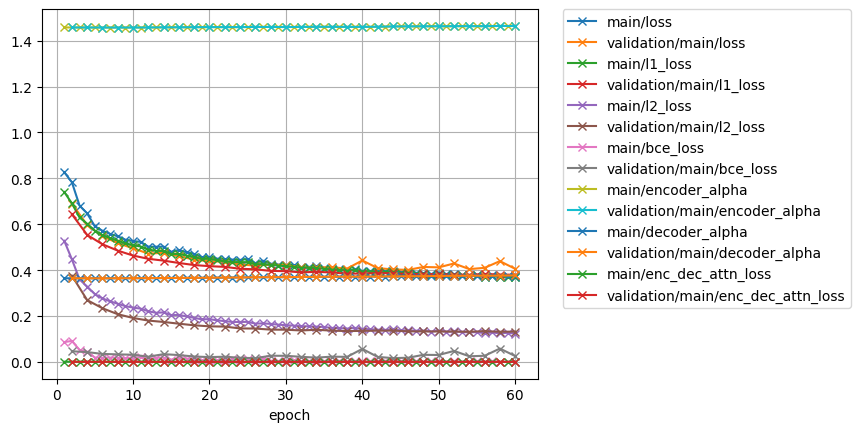
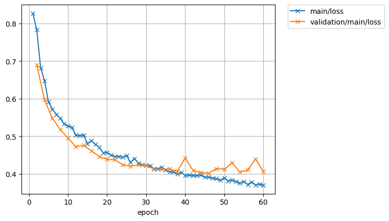
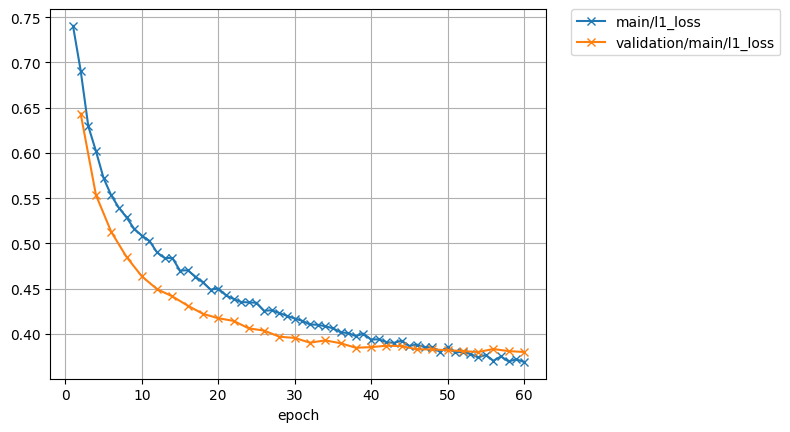
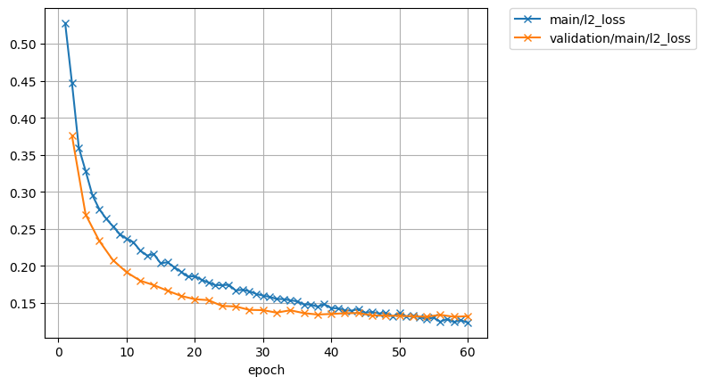
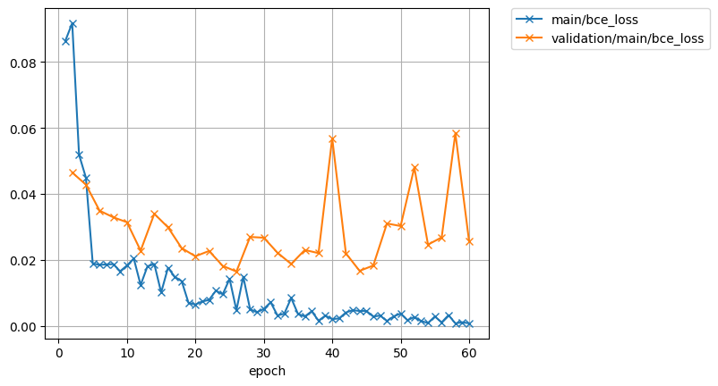
 
encoder-decoder  
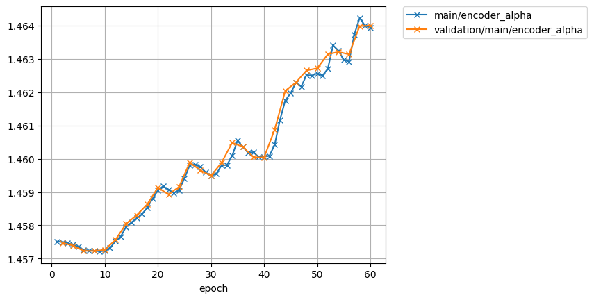
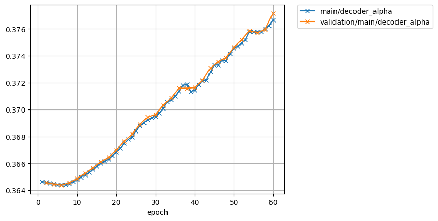
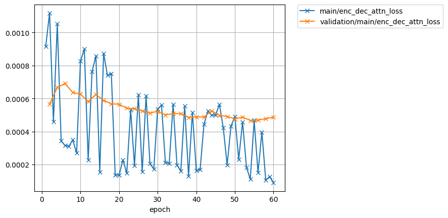

### lr: 1e-1

loss  
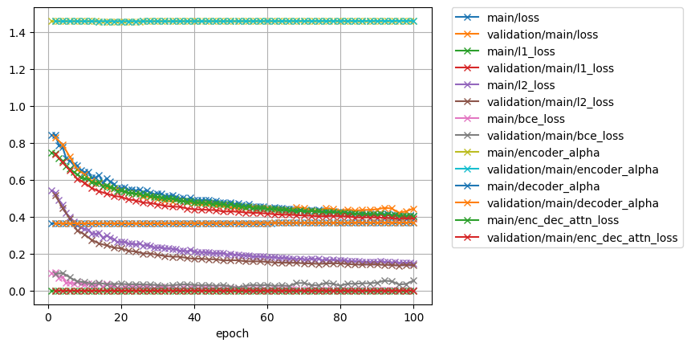
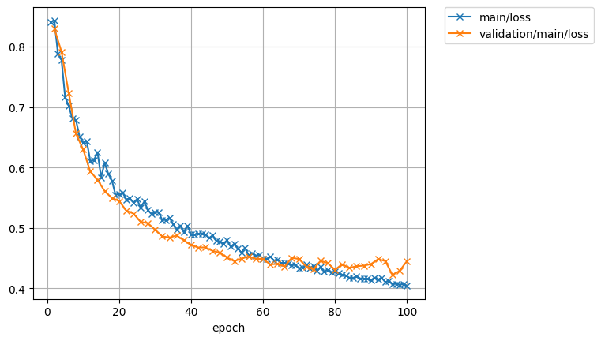
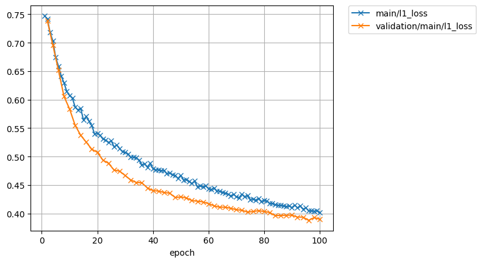
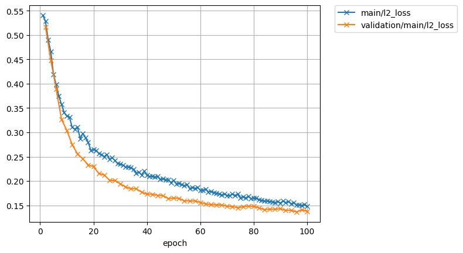
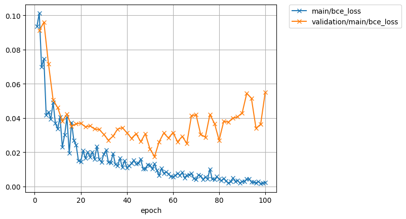
 
encoder-decoder  
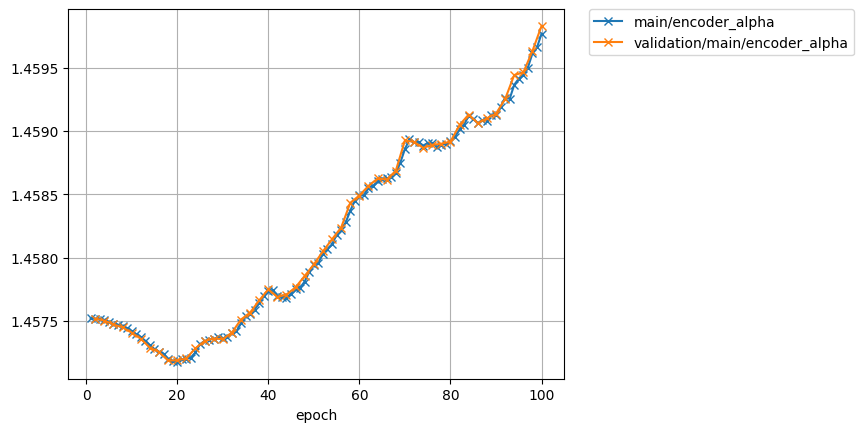
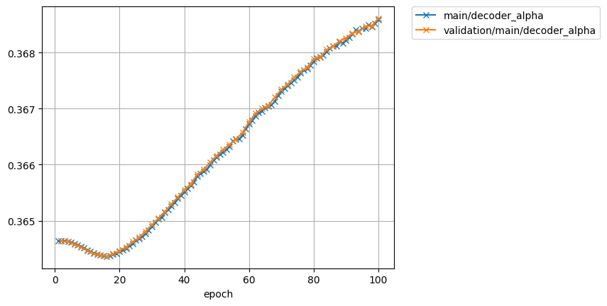
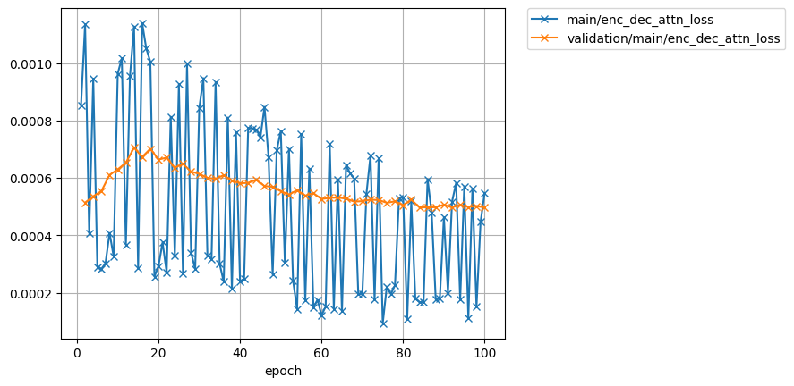

target for pre-train  
<audio src="../ljspeech_asrtts_offline/ljspeech.ground_truth/eval/wav/LJ050-0029.wav" controls></audio>  

1089_134691_000049_000001.wav  
Ground truth: Her eyes had called him and his soul had leaped at the call.  
Recog output: HER EYES HAD CALLED HIM AND HIS SOUL HAD LEAPED AT THE CALL.  

| type | wav |  
| --- | --- |  
| target for fine-tuning            | <audio src="../ljspeech_asrtts_offline/test_clean_22050_1089.ground_truth/eval/wav/1089_134691_000049_000001.wav" controls></audio> |  
| 0th decode                        | <audio src="../ljspeech_asrtts_offline/test_clean_22050_1089_train_no_dev_pytorch_tts_train_pytorch_transformer.fine-tuning.spk1089_lr1.rev1/eval_0th/wav/1089_134691_000049_000001.wav" controls></audio> | 
| avg.best  (lr:1e0, 60 epoch)      | <audio src="../ljspeech_asrtts_offline/test_clean_22050_1089_train_no_dev_pytorch_tts_train_pytorch_transformer.fine-tuning.spk1089_lr1.rev1/eval_avg.best/wav/1089_134691_000049_000001.wav" controls></audio> |  
| avg.best  (lr:1e-1, 100 epoch)    | <audio src="../ljspeech_asrtts_offline/test_clean_22050_1089_train_no_dev_pytorch_tts_train_pytorch_transformer.fine-tuning.spk1089_lr1e-1.rev2/eval_avg.best/wav/1089_134691_000049_000001.wav" controls></audio> |  

<!-- | loss.best (lr:1e0, 46 epoch)      | <audio src="../ljspeech_asrtts_offline/test_clean_22050_1089_train_no_dev_pytorch_tts_train_pytorch_transformer.fine-tuning.spk1089_lr1.rev1/eval_loss.best/wav/1089_134691_000049_000001.wav" controls></audio> |   -->
<!-- | avg.best  (lr:1e-1, 50 epoch)     | <audio src="../ljspeech_asrtts_offline/test_clean_22050_1089_train_no_dev_pytorch_tts_train_pytorch_transformer.fine-tuning.spk1089_lr1e-1.rev1/eval_avg.best/wav/1089_134691_000049_000001.wav" controls></audio> |   -->

1089_134691_000049_000002.wav  
Ground truth: To live, to err, to fall, to triumph, to recreate life out of life!  
Recog output: TO LIVE TO AIR TO FALL TO TRIUMPH TO RECREATE LIFE OUT OF LIFE.  

| type | wav |  
| --- | --- |  
| target for fine-tuning            | <audio src="../ljspeech_asrtts_offline/test_clean_22050_1089.ground_truth/eval/wav/1089_134691_000049_000002.wav" controls></audio> |  
| 0th decode                        | <audio src="../ljspeech_asrtts_offline/test_clean_22050_1089_train_no_dev_pytorch_tts_train_pytorch_transformer.fine-tuning.spk1089_lr1.rev1/eval_0th/wav/1089_134691_000049_000002.wav" controls></audio> |  
| avg.best  (lr:1e0, 60 epoch)      | <audio src="../ljspeech_asrtts_offline/test_clean_22050_1089_train_no_dev_pytorch_tts_train_pytorch_transformer.fine-tuning.spk1089_lr1.rev1/eval_avg.best/wav/1089_134691_000049_000002.wav" controls></audio> |  
| avg.best  (lr:1e-1, 100 epoch)    | <audio src="../ljspeech_asrtts_offline/test_clean_22050_1089_train_no_dev_pytorch_tts_train_pytorch_transformer.fine-tuning.spk1089_lr1e-1.rev2/eval_avg.best/wav/1089_134691_000049_000002.wav" controls></audio> |  

<!-- | loss.best (lr:1e0, 46 epoch)      | <audio src="../ljspeech_asrtts_offline/test_clean_22050_1089_train_no_dev_pytorch_tts_train_pytorch_transformer.fine-tuning.spk1089_lr1.rev1/eval_loss.best/wav/1089_134691_000049_000002.wav" controls></audio> |   -->
<!-- | avg.best  (lr:1e-1, 50 epoch)     | <audio src="../ljspeech_asrtts_offline/test_clean_22050_1089_train_no_dev_pytorch_tts_train_pytorch_transformer.fine-tuning.spk1089_lr1e-1.rev1/eval_avg.best/wav/1089_134691_000049_000002.wav" controls></audio> |   -->

1089_134691_000049_000003.wav  
Ground truth: A wild angel had appeared to him, the angel of mortal youth and beauty, an envoy from the fair courts of life, to throw open before him in an instant of ecstasy the gates of all the ways of error and glory.  
Recog output: A WILD ANGEL HAD APPEARED TO HIM THE ANGEL OF MORTAL YOUTH AND BEAUTY AND ENVOY FROM THE FAIR COURTS OF LIFE TO THROW OPEN BEFORE HIM IN AN INSTANT OF ECSTASY THE GATES OF ALL THE WAYS OF ERROR AND GLORY.  

| type | wav |  
| --- | --- |  
| target for fine-tuning            | <audio src="../ljspeech_asrtts_offline/test_clean_22050_1089.ground_truth/eval/wav/1089_134691_000049_000003.wav" controls></audio> |  
| 0th decode                        | <audio src="../ljspeech_asrtts_offline/test_clean_22050_1089_train_no_dev_pytorch_tts_train_pytorch_transformer.fine-tuning.spk1089_lr1.rev1/eval_0th/wav/1089_134691_000049_000003.wav" controls></audio> |  
| avg.best  (lr:1e0, 60 epoch)      | <audio src="../ljspeech_asrtts_offline/test_clean_22050_1089_train_no_dev_pytorch_tts_train_pytorch_transformer.fine-tuning.spk1089_lr1.rev1/eval_avg.best/wav/1089_134691_000049_000003.wav" controls></audio> |  
| avg.best  (lr:1e-1, 100 epoch)    | <audio src="../ljspeech_asrtts_offline/test_clean_22050_1089_train_no_dev_pytorch_tts_train_pytorch_transformer.fine-tuning.spk1089_lr1e-1.rev2/eval_avg.best/wav/1089_134691_000049_000003.wav" controls></audio> |  

<!-- | loss.best (lr:1e0, 46 epoch)      | <audio src="../ljspeech_asrtts_offline/test_clean_22050_1089_train_no_dev_pytorch_tts_train_pytorch_transformer.fine-tuning.spk1089_lr1.rev1/eval_loss.best/wav/1089_134691_000049_000003.wav" controls></audio> |   -->
<!-- | avg.best  (lr:1e-1, 50 epoch)     | <audio src="../ljspeech_asrtts_offline/test_clean_22050_1089_train_no_dev_pytorch_tts_train_pytorch_transformer.fine-tuning.spk1089_lr1e-1.rev1/eval_avg.best/wav/1089_134691_000049_000003.wav" controls></audio> |   -->

1089_134691_000050_000002.wav  
Ground truth: What hour was it?  
Recog output: WHAT HOUR WAS IT.  

| type | wav |  
| --- | --- |  
| target for fine-tuning            | <audio src="../ljspeech_asrtts_offline/test_clean_22050_1089.ground_truth/eval/wav/1089_134691_000050_000002.wav" controls></audio> |  
| 0th decode                        | <audio src="../ljspeech_asrtts_offline/test_clean_22050_1089_train_no_dev_pytorch_tts_train_pytorch_transformer.fine-tuning.spk1089_lr1.rev1/eval_0th/wav/1089_134691_000050_000002.wav" controls></audio> |  
| avg.best  (lr:1e0, 60 epoch)      | <audio src="../ljspeech_asrtts_offline/test_clean_22050_1089_train_no_dev_pytorch_tts_train_pytorch_transformer.fine-tuning.spk1089_lr1.rev1/eval_avg.best/wav/1089_134691_000050_000002.wav" controls></audio> |  
| avg.best  (lr:1e-1, 100 epoch)    | <audio src="../ljspeech_asrtts_offline/test_clean_22050_1089_train_no_dev_pytorch_tts_train_pytorch_transformer.fine-tuning.spk1089_lr1e-1.rev2/eval_avg.best/wav/1089_134691_000050_000002.wav" controls></audio> |  

<!-- | loss.best (lr:1e0, 46 epoch)      | <audio src="../ljspeech_asrtts_offline/test_clean_22050_1089_train_no_dev_pytorch_tts_train_pytorch_transformer.fine-tuning.spk1089_lr1.rev1/eval_loss.best/wav/1089_134691_000050_000002.wav" controls></audio> |   -->
<!-- | avg.best  (lr:1e-1, 50 epoch)     | <audio src="../ljspeech_asrtts_offline/test_clean_22050_1089_train_no_dev_pytorch_tts_train_pytorch_transformer.fine-tuning.spk1089_lr1e-1.rev1/eval_avg.best/wav/1089_134691_000050_000002.wav" controls></audio> |   -->

1089_134691_000052_000000.wav  
Ground truth: He felt above him the vast indifferent dome and the calm processes of the heavenly bodies; and the earth beneath him, the earth that had borne him, had taken him to her breast.  
Recog output: HE FELT ABOVE HIM THE VAST INDIFFERENT DOME AND THE CALM PROCESSES OF THE HEAVENLY BODIES AND THE EARTH BENEATH HIM THE EARTH THAT HAD BORNE HIM HAD TAKEN HIM TO HER BREAST.  

| type | wav |  
| --- | --- |  
| target for fine-tuning            | <audio src="../ljspeech_asrtts_offline/test_clean_22050_1089.ground_truth/eval/wav/1089_134691_000052_000000.wav" controls></audio> |  
| 0th decode                        | <audio src="../ljspeech_asrtts_offline/test_clean_22050_1089_train_no_dev_pytorch_tts_train_pytorch_transformer.fine-tuning.spk1089_lr1.rev1/eval_0th/wav/1089_134691_000052_000000.wav" controls></audio> |  
| avg.best  (lr:1e0, 60 epoch)      | <audio src="../ljspeech_asrtts_offline/test_clean_22050_1089_train_no_dev_pytorch_tts_train_pytorch_transformer.fine-tuning.spk1089_lr1.rev1/eval_avg.best/wav/1089_134691_000052_000000.wav" controls></audio> |  
| avg.best  (lr:1e-1, 100 epoch)    | <audio src="../ljspeech_asrtts_offline/test_clean_22050_1089_train_no_dev_pytorch_tts_train_pytorch_transformer.fine-tuning.spk1089_lr1e-1.rev2/eval_avg.best/wav/1089_134691_000052_000000.wav" controls></audio> |  

<!-- | loss.best (lr:1e0, 46 epoch)      | <audio src="../ljspeech_asrtts_offline/test_clean_22050_1089_train_no_dev_pytorch_tts_train_pytorch_transformer.fine-tuning.spk1089_lr1.rev1/eval_loss.best/wav/1089_134691_000052_000000.wav" controls></audio> |   -->
<!-- | avg.best  (lr:1e-1, 50 epoch)     | <audio src="../ljspeech_asrtts_offline/test_clean_22050_1089_train_no_dev_pytorch_tts_train_pytorch_transformer.fine-tuning.spk1089_lr1e-1.rev1/eval_avg.best/wav/1089_134691_000052_000000.wav" controls></audio> |   -->
