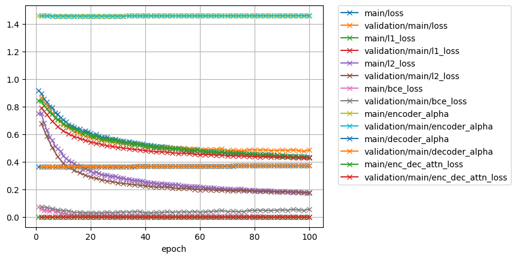
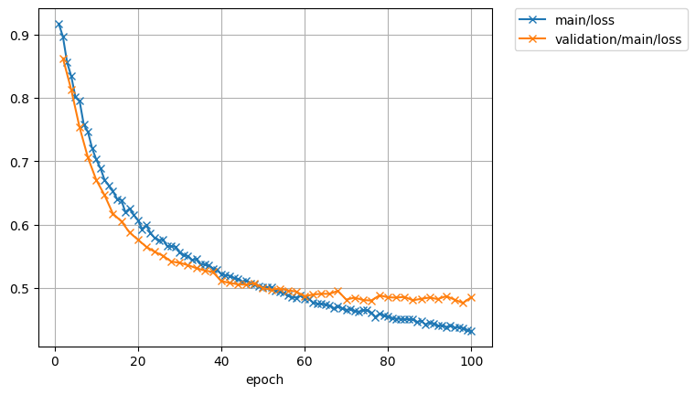
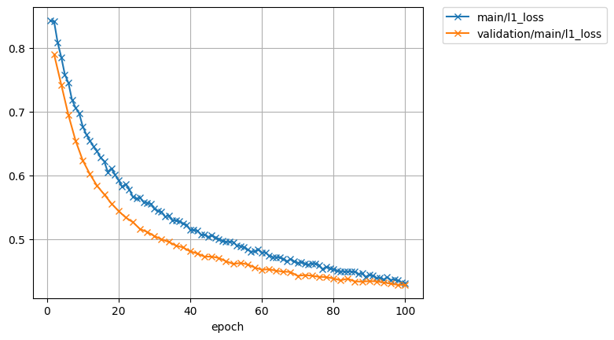
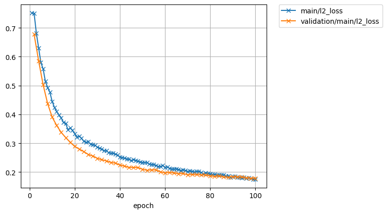
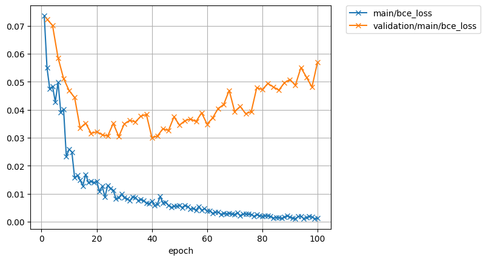
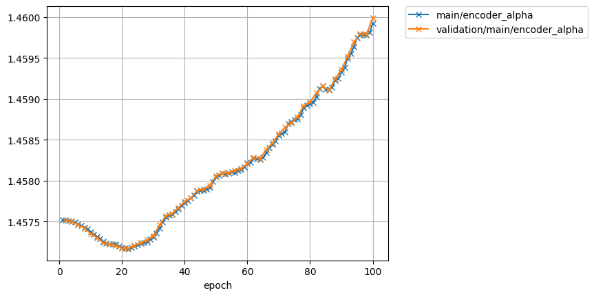
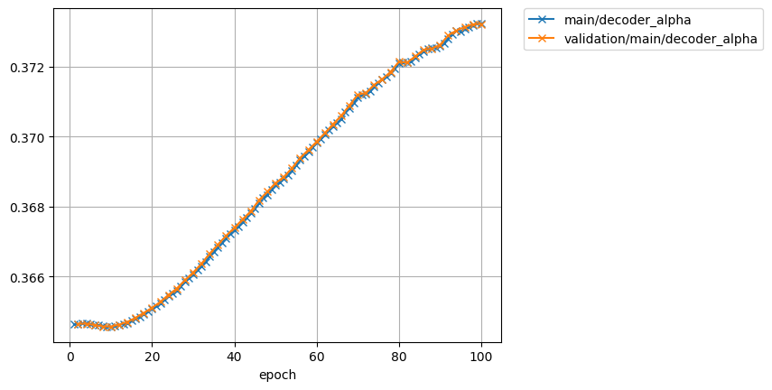
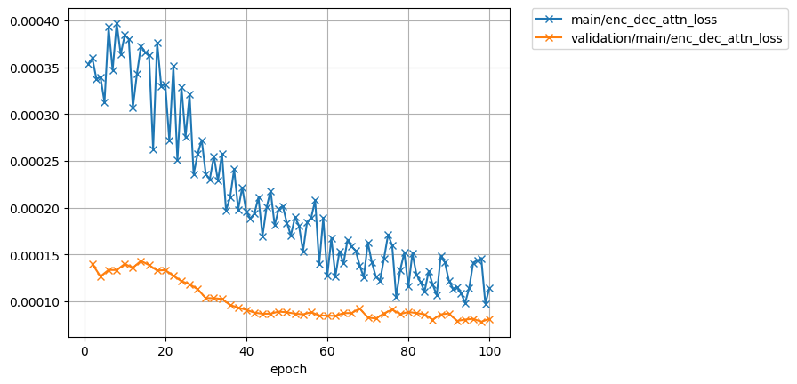

# Speaker adaptation for single speaker tts model

model: ljspeech.transformer.v1
text: ASR output
speech: speech of target speaker

## 2300(M)

| rev | 1 | 2 |  
| --- | --- | --- |  
| lr | 1e0 | 1e-1 |  
| epoch | - | 100 |  
| all_loss      |            |             |  
| loss          |                |                 |  
| l1_loss       |             |              |  
| l2_loss       |             |              |  
| bce_loss      |            |             |  
| encoder_alpha |       |        |  
| decoder_alpha |       |        |  
| attn_loss     |   |    |  

### target for pre-train  
<audio src="../ljspeech_asrtts_offline/ljspeech.ground_truth/eval/wav/LJ050-0029.wav" controls></audio>  

### 2300_131720_000042_000000.wav  

    Ground truth: The first Edison plant in a hotel was started in October, eighteen eighty one, at the Blue Mountain House in the Adirondacks, and consisted of two "Z" dynamos with a complement of eight and sixteen candle lamps. 
    Recog output: THE FIRST EDISON PLANT IN A HOTEL WAS STARTED IN OCTOBER EIGHTEEN EIGHTY ONE AT THE BLUE MOUNTAIN HOUSE IN THE ADIRONDACKS AND CONSISTED OF TWO Z DYNAMOS WITH A COMPLEMENT OF EIGHT AND SIXTEEN CANDLE LAMPS. 

| type | wav |  
| --- | --- |  
| target for fine-tuning            | <audio src="../ljspeech_asrtts_offline/test_clean_22050_2300.ground_truth/eval/wav/2300_131720_000042_000000.wav" controls></audio> |  
| 0th decode                        | <audio src="../ljspeech_asrtts_offline/test_clean_22050_2300_train_no_dev_pytorch_tts_train_pytorch_transformer.fine-tuning.spk2300_lr1.rev1/eval_0th/wav/2300_131720_000042_000000.wav" controls></audio> | 
| avg.best  (lr:1e0, - epoch)      | <audio src="../ljspeech_asrtts_offline/test_clean_22050_2300_train_no_dev_pytorch_tts_train_pytorch_transformer.fine-tuning.spk2300_lr1.rev1/eval_avg.best/wav/2300_131720_000042_000000.wav" controls></audio> |  
| avg.best  (lr:1e-1, 100 epoch)    | <audio src="../ljspeech_asrtts_offline/test_clean_22050_2300_train_no_dev_pytorch_tts_train_pytorch_transformer.fine-tuning.spk2300_lr1e-1.rev1/eval_avg.best/wav/2300_131720_000042_000000.wav" controls></audio> |  

### 2300_131720_000042_000001.wav  

    Ground truth: The hotel is situated at an elevation of thirty five hundred feet above the sea, and was at that time forty miles from the railroad. 
    Recog output: THE HOTEL IS SITUATED AT AN ELEVATION OF THIRTY FIVE HUNDRED FEET ABOVE THE SEA AND WAS AT THAT TIME FORTY MILES FROM THE RAILROAD. 

| type | wav |  
| --- | --- |  
| target for fine-tuning            | <audio src="../ljspeech_asrtts_offline/test_clean_22050_2300.ground_truth/eval/wav/2300_131720_000042_000001.wav" controls></audio> |  
| 0th decode                        | <audio src="../ljspeech_asrtts_offline/test_clean_22050_2300_train_no_dev_pytorch_tts_train_pytorch_transformer.fine-tuning.spk2300_lr1.rev1/eval_0th/wav/2300_131720_000042_000001.wav" controls></audio> |  
| avg.best  (lr:1e0, - epoch)      | <audio src="../ljspeech_asrtts_offline/test_clean_22050_2300_train_no_dev_pytorch_tts_train_pytorch_transformer.fine-tuning.spk2300_lr1.rev1/eval_avg.best/wav/2300_131720_000042_000001.wav" controls></audio> |  
| avg.best  (lr:1e-1, 100 epoch)    | <audio src="../ljspeech_asrtts_offline/test_clean_22050_2300_train_no_dev_pytorch_tts_train_pytorch_transformer.fine-tuning.spk2300_lr1e-1.rev1/eval_avg.best/wav/2300_131720_000042_000001.wav" controls></audio> |  

### 2300_131720_000042_000002.wav  

    Ground truth: The machinery was taken up in pieces on the backs of mules from the foot of the mountain. 
    Recog output: THE MACHINERY WAS TAKEN UP IN PIECES ON THE BACKS OF MULES FROM THE FOOT OF THE MOUNTAIN. 

| type | wav |  
| --- | --- |  
| target for fine-tuning            | <audio src="../ljspeech_asrtts_offline/test_clean_22050_2300.ground_truth/eval/wav/2300_131720_000042_000002.wav" controls></audio> |  
| 0th decode                        | <audio src="../ljspeech_asrtts_offline/test_clean_22050_2300_train_no_dev_pytorch_tts_train_pytorch_transformer.fine-tuning.spk2300_lr1.rev1/eval_0th/wav/2300_131720_000042_000002.wav" controls></audio> |  
| avg.best  (lr:1e0, - epoch)      | <audio src="../ljspeech_asrtts_offline/test_clean_22050_2300_train_no_dev_pytorch_tts_train_pytorch_transformer.fine-tuning.spk2300_lr1.rev1/eval_avg.best/wav/2300_131720_000042_000002.wav" controls></audio> |  
| avg.best  (lr:1e-1, 100 epoch)    | <audio src="../ljspeech_asrtts_offline/test_clean_22050_2300_train_no_dev_pytorch_tts_train_pytorch_transformer.fine-tuning.spk2300_lr1e-1.rev1/eval_avg.best/wav/2300_131720_000042_000002.wav" controls></audio> |  

### 2300_131720_000042_000003.wav  

    Ground truth: The boilers were fired by wood, as the economical transportation of coal was a physical impossibility. 
    Recog output: THE BOILERS WERE FIRED BY WOOD AS THE ECONOMICAL TRANSPORTATION OF COAL WAS A PHYSICAL IMPOSSIBILITY. 

| type | wav |  
| --- | --- |  
| target for fine-tuning            | <audio src="../ljspeech_asrtts_offline/test_clean_22050_2300.ground_truth/eval/wav/2300_131720_000042_000003.wav" controls></audio> |  
| 0th decode                        | <audio src="../ljspeech_asrtts_offline/test_clean_22050_2300_train_no_dev_pytorch_tts_train_pytorch_transformer.fine-tuning.spk2300_lr1.rev1/eval_0th/wav/2300_131720_000042_000003.wav" controls></audio> |  
| avg.best  (lr:1e0, - epoch)      | <audio src="../ljspeech_asrtts_offline/test_clean_22050_2300_train_no_dev_pytorch_tts_train_pytorch_transformer.fine-tuning.spk2300_lr1.rev1/eval_avg.best/wav/2300_131720_000042_000003.wav" controls></audio> |  
| avg.best  (lr:1e-1, 100 epoch)    | <audio src="../ljspeech_asrtts_offline/test_clean_22050_2300_train_no_dev_pytorch_tts_train_pytorch_transformer.fine-tuning.spk2300_lr1e-1.rev1/eval_avg.best/wav/2300_131720_000042_000003.wav" controls></audio> |  

### 2300_131720_000042_000004.wav  

    Ground truth: For a six hour run of the plant one quarter of a cord of wood was required, at a cost of twenty five cents per cord. 
    Recog output: FOR A SIX HOUR RUN OF THE PLANT ONE QUARTER OF A CORD OF WOOD WAS REQUIRED AT A COST OF TWENTY FIVE CENTS PER CORD. 

| type | wav |  
| --- | --- |  
| target for fine-tuning            | <audio src="../ljspeech_asrtts_offline/test_clean_22050_2300.ground_truth/eval/wav/2300_131720_000042_000004.wav" controls></audio> |  
| 0th decode                        | <audio src="../ljspeech_asrtts_offline/test_clean_22050_2300_train_no_dev_pytorch_tts_train_pytorch_transformer.fine-tuning.spk2300_lr1.rev1/eval_0th/wav/2300_131720_000042_000004.wav" controls></audio> |  
| avg.best  (lr:1e0, - epoch)      | <audio src="../ljspeech_asrtts_offline/test_clean_22050_2300_train_no_dev_pytorch_tts_train_pytorch_transformer.fine-tuning.spk2300_lr1.rev1/eval_avg.best/wav/2300_131720_000042_000004.wav" controls></audio> |  
| avg.best  (lr:1e-1, 100 epoch)    | <audio src="../ljspeech_asrtts_offline/test_clean_22050_2300_train_no_dev_pytorch_tts_train_pytorch_transformer.fine-tuning.spk2300_lr1e-1.rev1/eval_avg.best/wav/2300_131720_000042_000004.wav" controls></audio> |  
