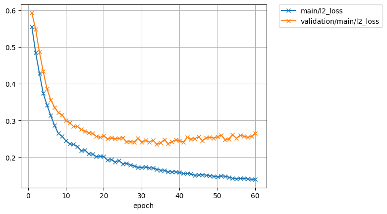

# Speaker adaptation for single speaker tts model

model: ljspeech.transformer.v1
text: ASR output
speech: speech of target speaker

## 4446(F)

| rev | 1 | 2 |  
| --- | --- | --- |  
| lr | 1e0 | 1e-1 |  
| epoch | 60 | 100 |  
| all_loss      |            |             |  
| loss          |                |                 |  
| l1_loss       |             |              |  
| l2_loss       |             |              |  
| bce_loss      |            |             |  
| encoder_alpha |       |        |  
| decoder_alpha |       |        |  
| attn_loss     |   |    |  

### target for pre-train  
<audio src="../ljspeech_asrtts_offline/ljspeech.ground_truth/eval/wav/LJ050-0029.wav" controls></audio>  

### 4446_2275_000044_000005.wav  

    Ground truth: I will do anything you say-but that! 
    Recog output: I WILL DO ANYTHING YOU SAY BUT THAT. 

| type | wav |  
| --- | --- |  
| target for fine-tuning            | <audio src="../ljspeech_asrtts_offline/test_clean_22050_4446.ground_truth/eval/wav/4446_2275_000044_000005.wav" controls></audio> |  
| 0th decode                        | <audio src="../ljspeech_asrtts_offline/test_clean_22050_4446_train_no_dev_pytorch_tts_train_pytorch_transformer.fine-tuning.spk4446_lr1.rev1/eval_0th/wav/4446_2275_000044_000005.wav" controls></audio> | 
| avg.best  (lr:1e0, 60 epoch)      | <audio src="../ljspeech_asrtts_offline/test_clean_22050_4446_train_no_dev_pytorch_tts_train_pytorch_transformer.fine-tuning.spk4446_lr1.rev1/eval_avg.best/wav/4446_2275_000044_000005.wav" controls></audio> |  
| avg.best  (lr:1e-1, 100 epoch)    | <audio src="../ljspeech_asrtts_offline/test_clean_22050_4446_train_no_dev_pytorch_tts_train_pytorch_transformer.fine-tuning.spk4446_lr1e-1.rev1/eval_avg.best/wav/4446_2275_000044_000005.wav" controls></audio> |  

### 4446_2275_000044_000006.wav  

    Ground truth: I will ask the least imaginable, but I must have SOMETHING!" 
    Recog output: I WILL ASK THE LEAST IMAGINABLE BUT I MUST HAVE SOMETHING. 

| type | wav |  
| --- | --- |  
| target for fine-tuning            | <audio src="../ljspeech_asrtts_offline/test_clean_22050_4446.ground_truth/eval/wav/4446_2275_000044_000006.wav" controls></audio> |  
| 0th decode                        | <audio src="../ljspeech_asrtts_offline/test_clean_22050_4446_train_no_dev_pytorch_tts_train_pytorch_transformer.fine-tuning.spk4446_lr1.rev1/eval_0th/wav/4446_2275_000044_000006.wav" controls></audio> |  
| avg.best  (lr:1e0, 60 epoch)      | <audio src="../ljspeech_asrtts_offline/test_clean_22050_4446_train_no_dev_pytorch_tts_train_pytorch_transformer.fine-tuning.spk4446_lr1.rev1/eval_avg.best/wav/4446_2275_000044_000006.wav" controls></audio> |  
| avg.best  (lr:1e-1, 100 epoch)    | <audio src="../ljspeech_asrtts_offline/test_clean_22050_4446_train_no_dev_pytorch_tts_train_pytorch_transformer.fine-tuning.spk4446_lr1e-1.rev1/eval_avg.best/wav/4446_2275_000044_000006.wav" controls></audio> |  

### 4446_2275_000045_000000.wav  

    Ground truth: Bartley turned away and sank down in his chair again. 
    Recog output: BARTLEY TURNED AWAY AND SANK DOWN IN HIS CHAIR AGAIN. 

| type | wav |  
| --- | --- |  
| target for fine-tuning            | <audio src="../ljspeech_asrtts_offline/test_clean_22050_4446.ground_truth/eval/wav/4446_2275_000045_000000.wav" controls></audio> |  
| 0th decode                        | <audio src="../ljspeech_asrtts_offline/test_clean_22050_4446_train_no_dev_pytorch_tts_train_pytorch_transformer.fine-tuning.spk4446_lr1.rev1/eval_0th/wav/4446_2275_000045_000000.wav" controls></audio> |  
| avg.best  (lr:1e0, 60 epoch)      | <audio src="../ljspeech_asrtts_offline/test_clean_22050_4446_train_no_dev_pytorch_tts_train_pytorch_transformer.fine-tuning.spk4446_lr1.rev1/eval_avg.best/wav/4446_2275_000045_000000.wav" controls></audio> |  
| avg.best  (lr:1e-1, 100 epoch)    | <audio src="../ljspeech_asrtts_offline/test_clean_22050_4446_train_no_dev_pytorch_tts_train_pytorch_transformer.fine-tuning.spk4446_lr1e-1.rev1/eval_avg.best/wav/4446_2275_000045_000000.wav" controls></audio> |  

### 4446_2275_000045_000001.wav  

    Ground truth: Hilda sat on the arm of it and put her hands lightly on his shoulders. 
    Recog output: HELD A SAT ON THE ARM OF IT AND PUT HER HANDS LIGHTLY ON HIS SHOULDERS. 

| type | wav |  
| --- | --- |  
| target for fine-tuning            | <audio src="../ljspeech_asrtts_offline/test_clean_22050_4446.ground_truth/eval/wav/4446_2275_000045_000001.wav" controls></audio> |  
| 0th decode                        | <audio src="../ljspeech_asrtts_offline/test_clean_22050_4446_train_no_dev_pytorch_tts_train_pytorch_transformer.fine-tuning.spk4446_lr1.rev1/eval_0th/wav/4446_2275_000045_000001.wav" controls></audio> |  
| avg.best  (lr:1e0, 60 epoch)      | <audio src="../ljspeech_asrtts_offline/test_clean_22050_4446_train_no_dev_pytorch_tts_train_pytorch_transformer.fine-tuning.spk4446_lr1.rev1/eval_avg.best/wav/4446_2275_000045_000001.wav" controls></audio> |  
| avg.best  (lr:1e-1, 100 epoch)    | <audio src="../ljspeech_asrtts_offline/test_clean_22050_4446_train_no_dev_pytorch_tts_train_pytorch_transformer.fine-tuning.spk4446_lr1e-1.rev1/eval_avg.best/wav/4446_2275_000045_000001.wav" controls></audio> |  

### 4446_2275_000046_000000.wav  

    Ground truth: "Just something Bartley. 
    Recog output: JUST SOMETHING BARTLEY. 

| type | wav |  
| --- | --- |  
| target for fine-tuning            | <audio src="../ljspeech_asrtts_offline/test_clean_22050_4446.ground_truth/eval/wav/4446_2275_000046_000000.wav" controls></audio> |  
| 0th decode                        | <audio src="../ljspeech_asrtts_offline/test_clean_22050_4446_train_no_dev_pytorch_tts_train_pytorch_transformer.fine-tuning.spk4446_lr1.rev1/eval_0th/wav/4446_2275_000046_000000.wav" controls></audio> |  
| avg.best  (lr:1e0, 60 epoch)      | <audio src="../ljspeech_asrtts_offline/test_clean_22050_4446_train_no_dev_pytorch_tts_train_pytorch_transformer.fine-tuning.spk4446_lr1.rev1/eval_avg.best/wav/4446_2275_000046_000000.wav" controls></audio> |  
| avg.best  (lr:1e-1, 100 epoch)    | <audio src="../ljspeech_asrtts_offline/test_clean_22050_4446_train_no_dev_pytorch_tts_train_pytorch_transformer.fine-tuning.spk4446_lr1e-1.rev1/eval_avg.best/wav/4446_2275_000046_000000.wav" controls></audio> |  
