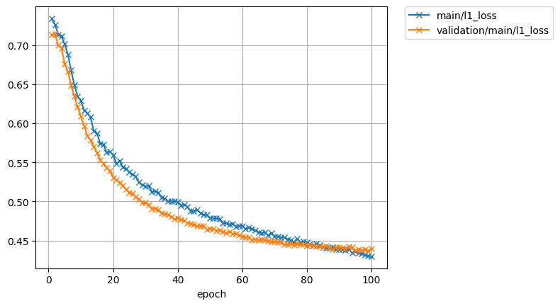

# Speaker adaptation for single speaker tts model

model: ljspeech.transformer.v1
text: ASR output
speech: speech of target speaker

## 5683(F)

| rev | 1 | 2 |  
| --- | --- | --- |  
| lr | 1e0 | 1e-1 |  
| epoch | - | 100 |  
| all_loss      |            |             |  
| loss          |                |                 |  
| l1_loss       |             |              |  
| l2_loss       |             |              |  
| bce_loss      |            |             |  
| encoder_alpha |       |        |  
| decoder_alpha |       |        |  
| attn_loss     |   |    |  

### target for pre-train  
<audio src="../ljspeech_asrtts_offline/ljspeech.ground_truth/eval/wav/LJ050-0029.wav" controls></audio>  

### 5683_32879_000046_000002.wav  

    Ground truth: Thank you, from my heart, for your love; you will never know, perhaps, how much it is to me.' 
    Recog output: THANK YOU FROM MY HEART FOR YOUR LOVE YOU WILL NEVER KNOW PERHAPS HOW MUCH IT IS TO ME. 

| type | wav |  
| --- | --- |  
| target for fine-tuning            | <audio src="../ljspeech_asrtts_offline/test_clean_22050_5683.ground_truth/eval/wav/5683_32879_000046_000002.wav" controls></audio> |  
| 0th decode                        | <audio src="../ljspeech_asrtts_offline/test_clean_22050_5683_train_no_dev_pytorch_tts_train_pytorch_transformer.fine-tuning.spk5683_lr1.rev1/eval_0th/wav/5683_32879_000046_000002.wav" controls></audio> | 
| avg.best  (lr:1e0, - epoch)      | <audio src="../ljspeech_asrtts_offline/test_clean_22050_5683_train_no_dev_pytorch_tts_train_pytorch_transformer.fine-tuning.spk5683_lr1.rev1/eval_avg.best/wav/5683_32879_000046_000002.wav" controls></audio> |  
| avg.best  (lr:1e-1, 100 epoch)    | <audio src="../ljspeech_asrtts_offline/test_clean_22050_5683_train_no_dev_pytorch_tts_train_pytorch_transformer.fine-tuning.spk5683_lr1e-1.rev1/eval_avg.best/wav/5683_32879_000046_000002.wav" controls></audio> |  

### 5683_32879_000047_000000.wav  

    Ground truth: The young queen looked on her kindly, but sadly, through her large, strange eyes, clouded with a presage of futurity, and she kissed her again, and said- 
    Recog output: THE YOUNG QUEEN LOOKED ON HER KINDLY BUT SADLY THROUGH HER LARGE STRANGE EYES CLOUDED WITH A PRESAGE OF FUTURITY AND SHE KISSED HER AGAIN AND SAID. 

| type | wav |  
| --- | --- |  
| target for fine-tuning            | <audio src="../ljspeech_asrtts_offline/test_clean_22050_5683.ground_truth/eval/wav/5683_32879_000047_000000.wav" controls></audio> |  
| 0th decode                        | <audio src="../ljspeech_asrtts_offline/test_clean_22050_5683_train_no_dev_pytorch_tts_train_pytorch_transformer.fine-tuning.spk5683_lr1.rev1/eval_0th/wav/5683_32879_000047_000000.wav" controls></audio> |  
| avg.best  (lr:1e0, - epoch)      | <audio src="../ljspeech_asrtts_offline/test_clean_22050_5683_train_no_dev_pytorch_tts_train_pytorch_transformer.fine-tuning.spk5683_lr1.rev1/eval_avg.best/wav/5683_32879_000047_000000.wav" controls></audio> |  
| avg.best  (lr:1e-1, 100 epoch)    | <audio src="../ljspeech_asrtts_offline/test_clean_22050_5683_train_no_dev_pytorch_tts_train_pytorch_transformer.fine-tuning.spk5683_lr1e-1.rev1/eval_avg.best/wav/5683_32879_000047_000000.wav" controls></audio> |  

### 5683_32879_000048_000000.wav  

    Ground truth: 'Rachel, dear, I have a plan for you and me: we shall be old maids, you and I, and live together like the ladies of Llangollen, careless and happy recluses. 
    Recog output: RACHEL DEAR I HAVE A PLAN FOR YOU AND ME WE SHALL BE OLD MAIDS YOU AND I AND LIVE TOGETHER LIKE THE LADIES OF LLANGORREN CARELESS AND HAPPY RECLUSES. 

| type | wav |  
| --- | --- |  
| target for fine-tuning            | <audio src="../ljspeech_asrtts_offline/test_clean_22050_5683.ground_truth/eval/wav/5683_32879_000048_000000.wav" controls></audio> |  
| 0th decode                        | <audio src="../ljspeech_asrtts_offline/test_clean_22050_5683_train_no_dev_pytorch_tts_train_pytorch_transformer.fine-tuning.spk5683_lr1.rev1/eval_0th/wav/5683_32879_000048_000000.wav" controls></audio> |  
| avg.best  (lr:1e0, - epoch)      | <audio src="../ljspeech_asrtts_offline/test_clean_22050_5683_train_no_dev_pytorch_tts_train_pytorch_transformer.fine-tuning.spk5683_lr1.rev1/eval_avg.best/wav/5683_32879_000048_000000.wav" controls></audio> |  
| avg.best  (lr:1e-1, 100 epoch)    | <audio src="../ljspeech_asrtts_offline/test_clean_22050_5683_train_no_dev_pytorch_tts_train_pytorch_transformer.fine-tuning.spk5683_lr1e-1.rev1/eval_avg.best/wav/5683_32879_000048_000000.wav" controls></audio> |  

### 5683_32879_000048_000001.wav  

    Ground truth: I'll let Brandon and abdicate. 
    Recog output: I'LL LET BRANDON AND ABDICATE. 

| type | wav |  
| --- | --- |  
| target for fine-tuning            | <audio src="../ljspeech_asrtts_offline/test_clean_22050_5683.ground_truth/eval/wav/5683_32879_000048_000001.wav" controls></audio> |  
| 0th decode                        | <audio src="../ljspeech_asrtts_offline/test_clean_22050_5683_train_no_dev_pytorch_tts_train_pytorch_transformer.fine-tuning.spk5683_lr1.rev1/eval_0th/wav/5683_32879_000048_000001.wav" controls></audio> |  
| avg.best  (lr:1e0, - epoch)      | <audio src="../ljspeech_asrtts_offline/test_clean_22050_5683_train_no_dev_pytorch_tts_train_pytorch_transformer.fine-tuning.spk5683_lr1.rev1/eval_avg.best/wav/5683_32879_000048_000001.wav" controls></audio> |  
| avg.best  (lr:1e-1, 100 epoch)    | <audio src="../ljspeech_asrtts_offline/test_clean_22050_5683_train_no_dev_pytorch_tts_train_pytorch_transformer.fine-tuning.spk5683_lr1e-1.rev1/eval_avg.best/wav/5683_32879_000048_000001.wav" controls></audio> |  

### 5683_32879_000048_000002.wav  

    Ground truth: We will make a little tour together, when all this shall have blown over, in a few weeks, and choose our retreat; and with the winter's snow we'll vanish from Brandon, and appear with the early flowers at our cottage among the beautiful woods and hills of Wales. 
    Recog output: WE WILL MAKE A LITTLE TOUR TOGETHER WHEN ALL THE SHELL HAVE BLOWN OVER IN A FEW WEEKS AND CHOOSE OUR RETREAT AND WITH THE WINTER SNOW WILL VANISH FROM BRANDON AND APPEAR WITH THE EARLY FLOWERS AT OUR COTTAGE AMONG THE BEAUTIFUL WOODS AND HILLS OF WALES. 

| type | wav |  
| --- | --- |  
| target for fine-tuning            | <audio src="../ljspeech_asrtts_offline/test_clean_22050_5683.ground_truth/eval/wav/5683_32879_000048_000002.wav" controls></audio> |  
| 0th decode                        | <audio src="../ljspeech_asrtts_offline/test_clean_22050_5683_train_no_dev_pytorch_tts_train_pytorch_transformer.fine-tuning.spk5683_lr1.rev1/eval_0th/wav/5683_32879_000048_000002.wav" controls></audio> |  
| avg.best  (lr:1e0, - epoch)      | <audio src="../ljspeech_asrtts_offline/test_clean_22050_5683_train_no_dev_pytorch_tts_train_pytorch_transformer.fine-tuning.spk5683_lr1.rev1/eval_avg.best/wav/5683_32879_000048_000002.wav" controls></audio> |  
| avg.best  (lr:1e-1, 100 epoch)    | <audio src="../ljspeech_asrtts_offline/test_clean_22050_5683_train_no_dev_pytorch_tts_train_pytorch_transformer.fine-tuning.spk5683_lr1e-1.rev1/eval_avg.best/wav/5683_32879_000048_000002.wav" controls></audio> |  
