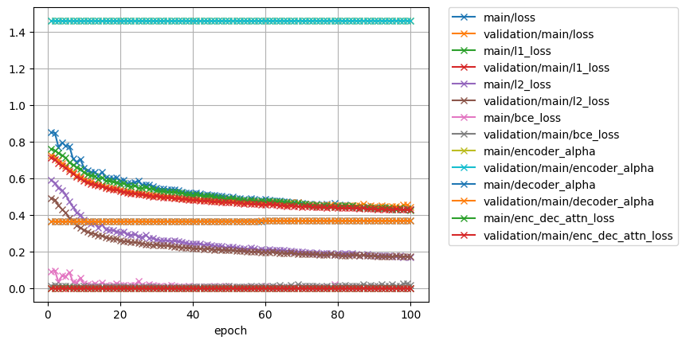
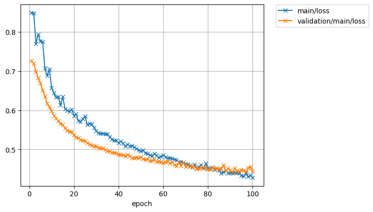
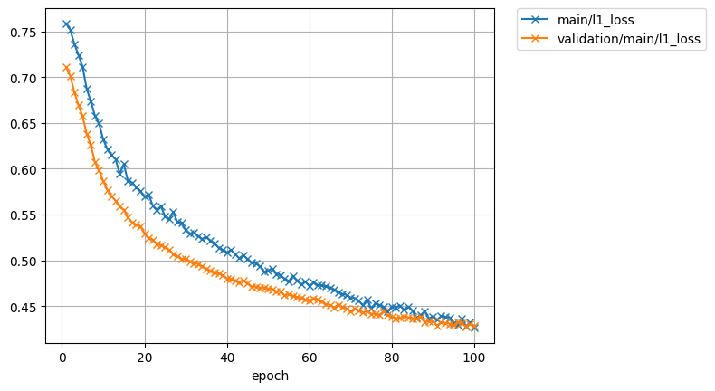
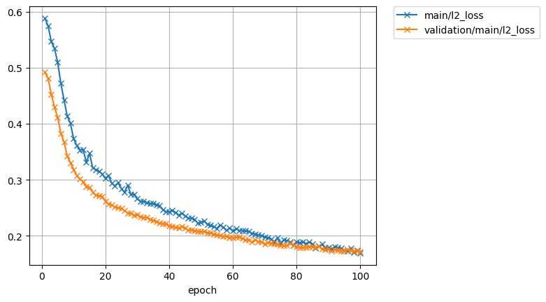
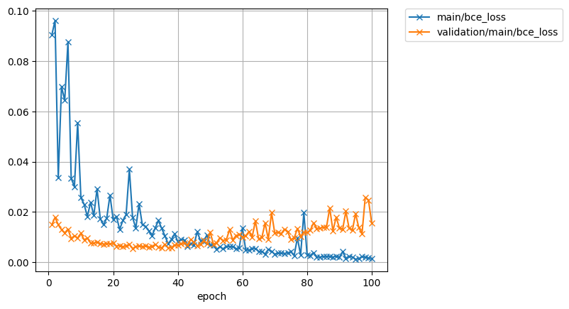
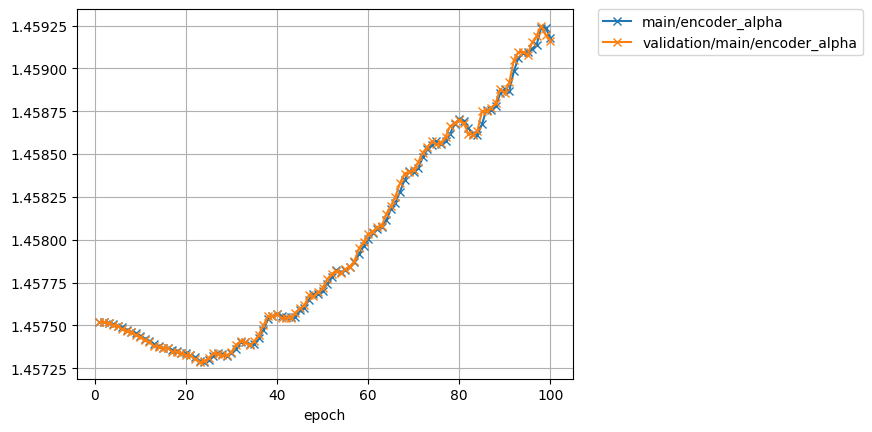
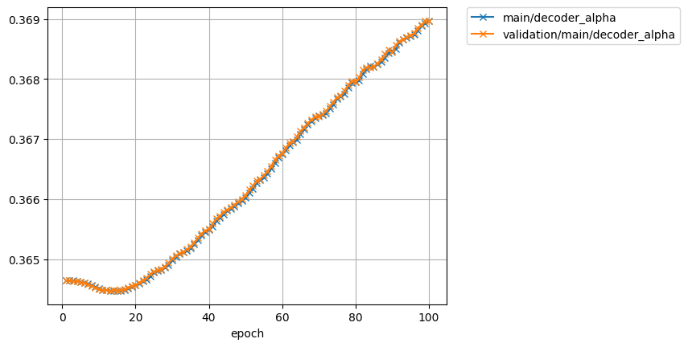
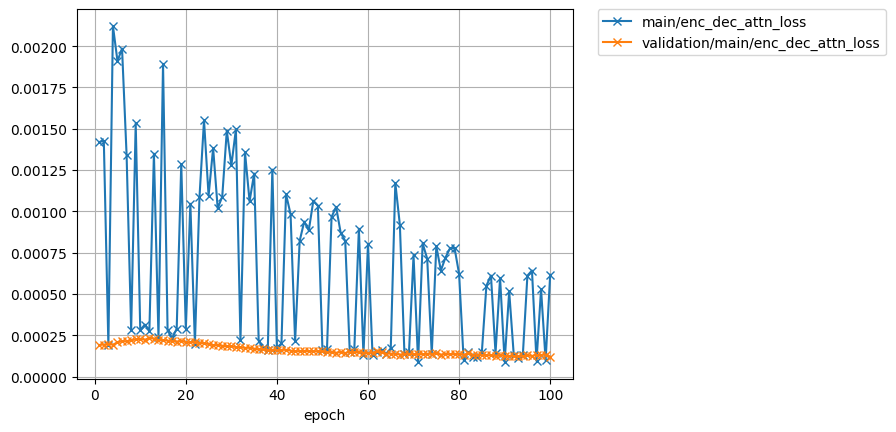

# Speaker adaptation for single speaker tts model

model: ljspeech.transformer.v1
text: ASR output
speech: speech of target speaker

## 8230(M)

| rev | 1 | 2 |  
| --- | --- | --- |  
| lr | 1e0 | 1e-1 |  
| epoch | - | 100 |  
| all_loss      |            |             |  
| loss          |                |                 |  
| l1_loss       |             |              |  
| l2_loss       |             |              |  
| bce_loss      |            |             |  
| encoder_alpha |       |        |  
| decoder_alpha |       |        |  
| attn_loss     |   |    |  

### target for pre-train  
<audio src="../ljspeech_asrtts_offline/ljspeech.ground_truth/eval/wav/LJ050-0029.wav" controls></audio>  

### 8230_279154_000028_000004.wav  

    Ground truth: I do not wish to undertake the analysis of belief at present, since it will be the subject of the twelfth lecture; for the present I merely wish to emphasize the fact that recognition, in our second sense, consists in a belief, which we may express approximately in the words: "This has existed before." 
    Recog output: I DO NOT WISH TO UNDERTAKE THE ANALYSIS OF BELIEF AT PRESENT SINCE IT WILL BE THE SUBJECT OF THE TWELFTH LECTURE FOR THE PRESENT I MERELY WISH TO EMPHASIZE THE FACT THAT RECOGNITION IN OUR SECOND SENSE CONSISTS IN A BELIEF WHICH WE MAY EXPRESS APPROXIMATELY IN THE WORDS THIS HAS EXISTED BEFORE. 

| type | wav |  
| --- | --- |  
| target for fine-tuning            | <audio src="../ljspeech_asrtts_offline/test_clean_22050_8230.ground_truth/eval/wav/8230_279154_000028_000004.wav" controls></audio> |  
| 0th decode                        | <audio src="../ljspeech_asrtts_offline/test_clean_22050_8230_train_no_dev_pytorch_tts_train_pytorch_transformer.fine-tuning.spk8230_lr1.rev1/eval_0th/wav/8230_279154_000028_000004.wav" controls></audio> | 
| avg.best  (lr:1e0, - epoch)      | <audio src="../ljspeech_asrtts_offline/test_clean_22050_8230_train_no_dev_pytorch_tts_train_pytorch_transformer.fine-tuning.spk8230_lr1.rev1/eval_avg.best/wav/8230_279154_000028_000004.wav" controls></audio> |  
| avg.best  (lr:1e-1, 100 epoch)    | <audio src="../ljspeech_asrtts_offline/test_clean_22050_8230_train_no_dev_pytorch_tts_train_pytorch_transformer.fine-tuning.spk8230_lr1e-1.rev1/eval_avg.best/wav/8230_279154_000028_000004.wav" controls></audio> |  

### 8230_279154_000029_000001.wav  

    Ground truth: To begin with, it might seem at first sight more correct to define recognition as "I have seen this before" than as "this has existed before." We recognize a thing (it may be urged) as having been in our experience before, whatever that may mean; we do not recognize it as merely having been in the world before. 
    Recog output: TO BEGIN WITH IT MIGHT SEEM AT FIRST SIGHT MORE CORRECT TO DEFINE RECOGNITION AS I HAVE SEEN THIS BEFORE THAN AS THIS HAS EXISTED BEFORE WE RECOGNIZE A THING IT MAY BE URGED AS HAVING BEEN IN OUR EXPERIENCE BEFORE WHATEVER THAT MAY MEAN OR WE DO NOT RECOGNIZE IT AS MERELY HAVING BEEN IN THE WORLD BEFORE. 

| type | wav |  
| --- | --- |  
| target for fine-tuning            | <audio src="../ljspeech_asrtts_offline/test_clean_22050_8230.ground_truth/eval/wav/8230_279154_000029_000001.wav" controls></audio> |  
| 0th decode                        | <audio src="../ljspeech_asrtts_offline/test_clean_22050_8230_train_no_dev_pytorch_tts_train_pytorch_transformer.fine-tuning.spk8230_lr1.rev1/eval_0th/wav/8230_279154_000029_000001.wav" controls></audio> |  
| avg.best  (lr:1e0, - epoch)      | <audio src="../ljspeech_asrtts_offline/test_clean_22050_8230_train_no_dev_pytorch_tts_train_pytorch_transformer.fine-tuning.spk8230_lr1.rev1/eval_avg.best/wav/8230_279154_000029_000001.wav" controls></audio> |  
| avg.best  (lr:1e-1, 100 epoch)    | <audio src="../ljspeech_asrtts_offline/test_clean_22050_8230_train_no_dev_pytorch_tts_train_pytorch_transformer.fine-tuning.spk8230_lr1e-1.rev1/eval_avg.best/wav/8230_279154_000029_000001.wav" controls></audio> |  

### 8230_279154_000029_000002.wav  

    Ground truth: I am not sure that there is anything substantial in this point. 
    Recog output: I AM NOT SURE THAT THERE IS ANYTHING SUBSTANTIAL IN THIS POINT. 

| type | wav |  
| --- | --- |  
| target for fine-tuning            | <audio src="../ljspeech_asrtts_offline/test_clean_22050_8230.ground_truth/eval/wav/8230_279154_000029_000002.wav" controls></audio> |  
| 0th decode                        | <audio src="../ljspeech_asrtts_offline/test_clean_22050_8230_train_no_dev_pytorch_tts_train_pytorch_transformer.fine-tuning.spk8230_lr1.rev1/eval_0th/wav/8230_279154_000029_000002.wav" controls></audio> |  
| avg.best  (lr:1e0, - epoch)      | <audio src="../ljspeech_asrtts_offline/test_clean_22050_8230_train_no_dev_pytorch_tts_train_pytorch_transformer.fine-tuning.spk8230_lr1.rev1/eval_avg.best/wav/8230_279154_000029_000002.wav" controls></audio> |  
| avg.best  (lr:1e-1, 100 epoch)    | <audio src="../ljspeech_asrtts_offline/test_clean_22050_8230_train_no_dev_pytorch_tts_train_pytorch_transformer.fine-tuning.spk8230_lr1e-1.rev1/eval_avg.best/wav/8230_279154_000029_000002.wav" controls></audio> |  

### 8230_279154_000029_000003.wav  

    Ground truth: The definition of "my experience" is difficult; broadly speaking, it is everything that is connected with what I am experiencing now by certain links, of which the various forms of memory are among the most important. 
    Recog output: THE DEFINITION OF MY EXPERIENCE IS DIFFICULT BROADLY SPEAKING IT IS EVERYTHING THAT IS CONNECTED WITH WHAT I AM EXPERIENCING NOW BY CERTAIN LINKS OF WHICH THE VARIOUS FORMS OF MEMORY ARE AMONG THE MOST IMPORTANT. 

| type | wav |  
| --- | --- |  
| target for fine-tuning            | <audio src="../ljspeech_asrtts_offline/test_clean_22050_8230.ground_truth/eval/wav/8230_279154_000029_000003.wav" controls></audio> |  
| 0th decode                        | <audio src="../ljspeech_asrtts_offline/test_clean_22050_8230_train_no_dev_pytorch_tts_train_pytorch_transformer.fine-tuning.spk8230_lr1.rev1/eval_0th/wav/8230_279154_000029_000003.wav" controls></audio> |  
| avg.best  (lr:1e0, - epoch)      | <audio src="../ljspeech_asrtts_offline/test_clean_22050_8230_train_no_dev_pytorch_tts_train_pytorch_transformer.fine-tuning.spk8230_lr1.rev1/eval_avg.best/wav/8230_279154_000029_000003.wav" controls></audio> |  
| avg.best  (lr:1e-1, 100 epoch)    | <audio src="../ljspeech_asrtts_offline/test_clean_22050_8230_train_no_dev_pytorch_tts_train_pytorch_transformer.fine-tuning.spk8230_lr1e-1.rev1/eval_avg.best/wav/8230_279154_000029_000003.wav" controls></audio> |  

### 8230_279154_000029_000004.wav  

    Ground truth: Thus, if I recognize a thing, the occasion of its previous existence in virtue of which I recognize it forms part of "my experience" by DEFINITION: recognition will be one of the marks by which my experience is singled out from the rest of the world. 
    Recog output: THUS IF I RECOGNIZE A THING THE OCCASION OF ITS PREVIOUS EXISTENCE IN VIRTUE OF WHICH I RECOGNISE IT FORMS PART OF MY EXPERIENCE BY DEFINITION RECOGNITION WILL BE ONE OF THE MARKS BY WHICH MY EXPERIENCE IS SINGLED OUT FROM THE REST OF THE WORLD. 

| type | wav |  
| --- | --- |  
| target for fine-tuning            | <audio src="../ljspeech_asrtts_offline/test_clean_22050_8230.ground_truth/eval/wav/8230_279154_000029_000004.wav" controls></audio> |  
| 0th decode                        | <audio src="../ljspeech_asrtts_offline/test_clean_22050_8230_train_no_dev_pytorch_tts_train_pytorch_transformer.fine-tuning.spk8230_lr1.rev1/eval_0th/wav/8230_279154_000029_000004.wav" controls></audio> |  
| avg.best  (lr:1e0, - epoch)      | <audio src="../ljspeech_asrtts_offline/test_clean_22050_8230_train_no_dev_pytorch_tts_train_pytorch_transformer.fine-tuning.spk8230_lr1.rev1/eval_avg.best/wav/8230_279154_000029_000004.wav" controls></audio> |  
| avg.best  (lr:1e-1, 100 epoch)    | <audio src="../ljspeech_asrtts_offline/test_clean_22050_8230_train_no_dev_pytorch_tts_train_pytorch_transformer.fine-tuning.spk8230_lr1e-1.rev1/eval_avg.best/wav/8230_279154_000029_000004.wav" controls></audio> |  
