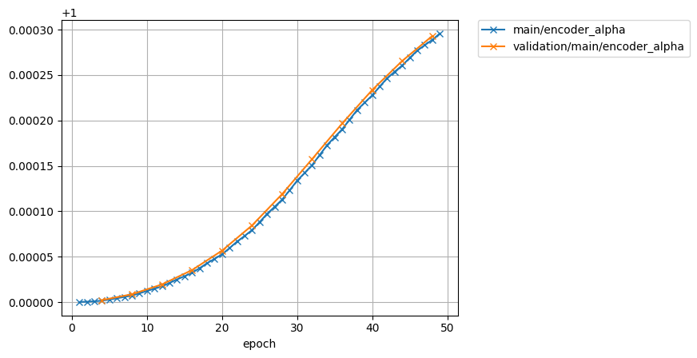

# Speaker adaptation for multi speaker tts model

model: libritts.transformer.v1
text: ASR output
speech: speech of target speaker

## 1089(M)

1089_134691_000049_000001.wav  

| type | wav |  
| --- | --- |  
| target for fine-tuning    | <audio src="libritts_asrtts_offline/test_clean_22050_1089.ground_truth/eval/wav/1089_134691_000049_000001.wav" controls></audio> |  
| 0th decode (0 epoch)      | <audio src="libritts_asrtts_offline/test_clean_1089_train_no_dev_pytorch_tts_train_pytorch_transformer.fine-tuning.spk1089_lr1.rev1/eval_0th/wav/1089_134691_000049_000001.wav" controls></audio> |  
| avg.best   (50  epoch)    | <audio src="libritts_asrtts_offline/test_clean_1089_train_no_dev_pytorch_tts_train_pytorch_transformer.fine-tuning.spk1089_lr1.rev1/eval_avg.best/wav/1089_134691_000049_000001.wav" controls></audio> |  

1089_134691_000049_000002.wav  

| type | wav |  
| --- | --- |  
| target for fine-tuning    | <audio src="libritts_asrtts_offline/test_clean_22050_1089.ground_truth/eval/wav/1089_134691_000049_000002.wav" controls></audio> |  
| 0th decode (0 epoch)      | <audio src="libritts_asrtts_offline/test_clean_1089_train_no_dev_pytorch_tts_train_pytorch_transformer.fine-tuning.spk1089_lr1.rev1/eval_0th/wav/1089_134691_000049_000002.wav" controls></audio> |  
| avg.best   (50 epoch)     | <audio src="libritts_asrtts_offline/test_clean_1089_train_no_dev_pytorch_tts_train_pytorch_transformer.fine-tuning.spk1089_lr1.rev1/eval_avg.best/wav/1089_134691_000049_000002.wav" controls></audio> |  

1089_134691_000049_000003.wav  

| type | wav |  
| --- | --- |  
| target for fine-tuning    | <audio src="libritts_asrtts_offline/test_clean_22050_1089.ground_truth/eval/wav/1089_134691_000049_000003.wav" controls></audio> |  
| 0th decode (0 epoch)      | <audio src="libritts_asrtts_offline/test_clean_1089_train_no_dev_pytorch_tts_train_pytorch_transformer.fine-tuning.spk1089_lr1.rev1/eval_0th/wav/1089_134691_000049_000003.wav" controls></audio> |  
| avg.best   (50 epoch)     | <audio src="libritts_asrtts_offline/test_clean_1089_train_no_dev_pytorch_tts_train_pytorch_transformer.fine-tuning.spk1089_lr1.rev1/eval_avg.best/wav/1089_134691_000049_000003.wav" controls></audio> |  

1089_134691_000050_000002.wav  

| type | wav |  
| --- | --- |  
| target for fine-tuning    | <audio src="libritts_asrtts_offline/test_clean_22050_1089.ground_truth/eval/wav/1089_134691_000050_000002.wav" controls></audio> |  
| 0th decode (0 epoch)      | <audio src="libritts_asrtts_offline/test_clean_1089_train_no_dev_pytorch_tts_train_pytorch_transformer.fine-tuning.spk1089_lr1.rev1/eval_0th/wav/1089_134691_000050_000002.wav" controls></audio> |  
| avg.best   (50 epoch)     | <audio src="libritts_asrtts_offline/test_clean_1089_train_no_dev_pytorch_tts_train_pytorch_transformer.fine-tuning.spk1089_lr1.rev1/eval_avg.best/wav/1089_134691_000050_000002.wav" controls></audio> |  

1089_134691_000051_000000.wav  

| type | wav |  
| --- | --- |  
| target for fine-tuning    | <audio src="libritts_asrtts_offline/test_clean_22050_1089.ground_truth/eval/wav/1089_134691_000052_000000.wav" controls></audio> |  
| 0th decode (0 epoch)      | <audio src="libritts_asrtts_offline/test_clean_1089_train_no_dev_pytorch_tts_train_pytorch_transformer.fine-tuning.spk1089_lr1.rev1/eval_0th/wav/1089_134691_000052_000000.wav" controls></audio> |  
| avg.best   (50 epoch)     | <audio src="libritts_asrtts_offline/test_clean_1089_train_no_dev_pytorch_tts_train_pytorch_transformer.fine-tuning.spk1089_lr1.rev1/eval_avg.best/wav/1089_134691_000052_000000.wav" controls></audio> |  

