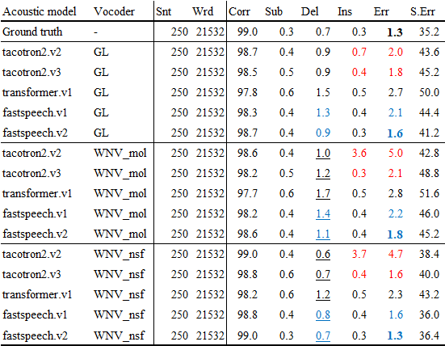

# Diff between GL and WNV

## Original results

| Acoustic model | Vocoder | Snt | Wrd | Corr | Sub | Del | Ins | Err | S.Err |  
| --- | --- | --- | --- | --- | --- | --- | --- | --- | --- |  
| fastspeech.v2 | GL       | 250 | 21532 | 98.7 | 0.4 | 0.9 | 0.3 | 1.6 | 41.2 |  
| fastspeech.v2 | WNV_mol  | 250 | 21532 | 98.6 | 0.4 | 1.1 | 0.4 | 1.8 | 45.2 |  
| fastspeech.v2 | WNV_nsf  | 250 | 21532 | 99.0 | 0.3 | 0.7 | 0.3 | 1.3 | 36.4 |  

## ASR output

    fastspeech.v2 GL
    id: (lj050_0030)
    Scores: (#C #S #D #I) 27 0 0 0
    REF:  t h e c o m m i s s i o n a l s o r e c o m m e n d s 
    HYP:  t h e c o m m i s s i o n a l s o r e c o m m e n d s 
    Eval:                                                       
    ---
    fastspeech.v2 wnv_mol
    id: (lj050_0030)
    Scores: (#C #S #D #I) 24 1 2 0
    REF:  T H E c o m m i s s i o n a l s o r e c o m m e n d s 
    HYP:  * * A c o m m i s s i o n a l s o r e c o m m e n d s 
    Eval: D D S                                                 
    ---
    fastspeech.v2 wnv_nsf
    id: (lj050_0030)
    Scores: (#C #S #D #I) 27 0 0 0
    REF:  t h e c o m m i s s i o n a l s o r e c o m m e n d s 
    HYP:  t h e c o m m i s s i o n a l s o r e c o m m e n d s 
    Eval:                                                       

## wav

| type | wav |  
| --- | --- |  
| GL v2      | <audio src="../diff_fastspeech/fastspeech.v2.GL/LJ050-0030.wav" controls></audio> |  
| WNV_mol v2 | <audio src="fastspeech.v2.wnv_mol/LJ050-0030_gen.wav" controls></audio> |  
| WNV_nsf v2 | <audio src="fastspeech.v2.wnv_nsf/LJ050-0030.wav" controls></audio> |  

## ASR output

    fastspeech.v2 GL
    id: (lj050_0031)
    Scores: (#C #S #D #I) 126 1 5 1
    REF:  T H A T t h e s e c r e t s e r v i c e c o n s c i o u s l y s e t a b o u t t h e t a s k o f i n c u l c a t i n g a n d m a i n t a i n i n g t h e h i g h e s t s t a n d a r d o f e x c e l l e n c e a n d e S p * r I t f o r a l l o f i t s p e r s o n n e l 
    HYP:  * * * * t h e s e c r e t s e r v i c e c o n s c i o u s l y s e t a b o u t t h e t a s k o f i n c u l c a t i n g a n d m a i n t a i n i n g t h e h i g h e s t s t a n d a r d o f e x c e l l e n c e a n d e X p E r * t f o r a l l o f i t s p e r s o n n e l 
    Eval: D D D D                                                                                                                                                                                                               S   I   D                                           
    ---
    fastspeech.v2 wnv_mol
    id: (lj050_0031)
    Scores: (#C #S #D #I) 126 1 5 1
    REF:  T H A T t h e s e c r e t s e r v i c e c o n s c i o u s l y s e t a b o u t t h e t a s k o f i n c u l c a t i n g a n d m a i n t a i n i n g t h e h i g h e s t s t a n d a r d o f e x c e l l e n c e a n d e S p * r I t f o r a l l o f i t s p e r s o n n e l 
    HYP:  * * * * t h e s e c r e t s e r v i c e c o n s c i o u s l y s e t a b o u t t h e t a s k o f i n c u l c a t i n g a n d m a i n t a i n i n g t h e h i g h e s t s t a n d a r d o f e x c e l l e n c e a n d e X p E r * t f o r a l l o f i t s p e r s o n n e l 
    Eval: D D D D                                                                                                                                                                                                               S   I   D                                           
    ---
    fastspeech.v2 wnv_nsf
    id: (lj050_0031)
    Scores: (#C #S #D #I) 130 1 1 1
    REF:  t h a t t h e s e c r e t s e r v i c e c o n s c i o u s l y s e t a b o u t t h e t a s k o f i n c u l c a t i n g a n d m a i n t a i n i n g t h e h i g h e s t s t a n d a r d o f e x c e l l e n c e a n d e S p * r I t f o r a l l o f i t s p e r s o n n e l 
    HYP:  t h a t t h e s e c r e t s e r v i c e c o n s c i o u s l y s e t a b o u t t h e t a s k o f i n c u l c a t i n g a n d m a i n t a i n i n g t h e h i g h e s t s t a n d a r d o f e x c e l l e n c e a n d e X p E r * t f o r a l l o f i t s p e r s o n n e l 
    Eval:                                                                                                                                                                                                                       S   I   D                                           

## wav

| type | wav |  
| --- | --- |  
| GL v2      | <audio src="../diff_fastspeech/fastspeech.v2.GL/LJ050-0031.wav" controls></audio> |  
| WNV_mol v2 | <audio src="fastspeech.v2.wnv_mol/LJ050-0031_gen.wav" controls></audio> |  
| WNV_nsf v2 | <audio src="fastspeech.v2.wnv_nsf/LJ050-0031.wav" controls></audio> |  

## ASR output

    fastspeech.v2 GL
    id: (lj050_0034)
    Scores: (#C #S #D #I) 75 0 3 0
    REF:  A N D t h e b r e a c h o f r e g u l a t i o n s w h i c h o c c u r r e d o n t h e n i g h t o f n o v e m b e r t w e n t y o n e a t f o r t w o r t h 
    HYP:  * * * t h e b r e a c h o f r e g u l a t i o n s w h i c h o c c u r r e d o n t h e n i g h t o f n o v e m b e r t w e n t y o n e a t f o r t w o r t h 
    Eval: D D D                                                                                                                                                       
    ---
    fastspeech.v2 wnv_mol
    id: (lj050_0034)
    Scores: (#C #S #D #I) 75 0 3 0
    REF:  A N D t h e b r e a c h o f r e g u l a t i o n s w h i c h o c c u r r e d o n t h e n i g h t o f n o v e m b e r t w e n t y o n e a t f o r t w o r t h 
    HYP:  * * * t h e b r e a c h o f r e g u l a t i o n s w h i c h o c c u r r e d o n t h e n i g h t o f n o v e m b e r t w e n t y o n e a t f o r t w o r t h 
    Eval: D D D                                                                                                                                                       
    ---
    fastspeech.v2 wnv_nsf
    id: (lj050_0034)
    Scores: (#C #S #D #I) 78 0 0 0
    REF:  a n d t h e b r e a c h o f r e g u l a t i o n s w h i c h o c c u r r e d o n t h e n i g h t o f n o v e m b e r t w e n t y o n e a t f o r t w o r t h 
    HYP:  a n d t h e b r e a c h o f r e g u l a t i o n s w h i c h o c c u r r e d o n t h e n i g h t o f n o v e m b e r t w e n t y o n e a t f o r t w o r t h 
    Eval:                                                                                                                                                             

## wav

| type | wav |  
| --- | --- |  
| GL v2      | <audio src="../diff_fastspeech/fastspeech.v2.GL/LJ050-0034.wav" controls></audio> |  
| WNV_mol v2 | <audio src="fastspeech.v2.wnv_mol/LJ050-0034_gen.wav" controls></audio> |  
| WNV_nsf v2 | <audio src="fastspeech.v2.wnv_nsf/LJ050-0034.wav" controls></audio> |  

## ASR output

    fastspeech.v2 GL
    id: (lj050_0065)
    Scores: (#C #S #D #I) 87 5 1 4
    REF:  a * l A n h b e l m o n t a s s i s t a n t t o t h e d i r e c t o r o f t h e f b i T e s T I F i e d t h a t t h i s r e v i s i o n w a s i n i t i a t e d b y t h * e f B i * * i t s e l f 
    HYP:  a L l E n h b e l m o n t a s s i s t a n t t o t h e d i r e c t o r o f t h e f b i D e s * C R i e d t h a t t h i s r e v i s i o n w a s i n i t i a t e d b y t h E e f F i G Y i t s e l f 
    Eval:   I   S                                                                               S     D S S                                                                       I     S   I I             
    ---
    fastspeech.v2 wnv_mol
    id: (lj050_0065)
    Scores: (#C #S #D #I) 80 5 8 2
    REF:  a * l A n h b e l m o n t a s s i s t A N T t o t h e d i r e c t o r o f t h e f b i * T E s t i f i e d t h a t t h i s r e v i s i o n w a s i n i t i a t e d b y t h e f b I I T S E L F 
    HYP:  a L l E n h b e l m o n t a s s i s t * E D t o t h e d i r e c t o r o f t h e f b i A J U s t i f i e d t h a t t h i s r e v i s i o n w a s i n i t i a t e d b y t h e f b * * * * * * * 
    Eval:   I   S                               D S S                                           I S S                                                                                     D D D D D D D 
    ---
    fastspeech.v2 wnv_nsf
    id: (lj050_0065)
    Scores: (#C #S #D #I) 90 3 0 2
    REF:  a * l A n h b e l m o n t a s s i s t a n t t o t h e d i r e c t o r o f t h e f b i T E s t i f i e d t h a t t h i s r e v i s i o n w a s i n i t i a t e d b y t h e f b i * i t s e l f 
    HYP:  a L l E n h b e l m o n t a s s i s t a n t t o t h e d i r e c t o r o f t h e f b i J U s t i f i e d t h a t t h i s r e v i s i o n w a s i n i t i a t e d b y t h e f b i A i t s e l f 
    Eval:   I   S                                                                               S S                                                                                       I             

## wav

| type | wav |  
| --- | --- |  
| GL v2      | <audio src="../diff_fastspeech/fastspeech.v2.GL/LJ050-0065.wav" controls></audio> |  
| WNV_mol v2 | <audio src="fastspeech.v2.wnv_mol/LJ050-0065_gen.wav" controls></audio> |  
| WNV_nsf v2 | <audio src="fastspeech.v2.wnv_nsf/LJ050-0065.wav" controls></audio> |  

## ASR output

    fastspeech.v2 GL
    id: (lj050_0069)
    Scores: (#C #S #D #I) 85 0 3 0
    REF:  T H E s e c r e t s e r v i c e h a d r e c e i v e d f r o m t h e f b i s o m e n i n e t h o u s a n d r e p o r t s o n m e m b e r s o f t h e c o m m u n i s t p a r t y 
    HYP:  * * * s e c r e t s e r v i c e h a d r e c e i v e d f r o m t h e f b i s o m e n i n e t h o u s a n d r e p o r t s o n m e m b e r s o f t h e c o m m u n i s t p a r t y 
    Eval: D D D                                                                                                                                                                           
    ---
    fastspeech.v2 wnv_mol
    id: (lj050_0069)
    Scores: (#C #S #D #I) 85 0 3 0
    REF:  T H E s e c r e t s e r v i c e h a d r e c e i v e d f r o m t h e f b i s o m e n i n e t h o u s a n d r e p o r t s o n m e m b e r s o f t h e c o m m u n i s t p a r t y 
    HYP:  * * * s e c r e t s e r v i c e h a d r e c e i v e d f r o m t h e f b i s o m e n i n e t h o u s a n d r e p o r t s o n m e m b e r s o f t h e c o m m u n i s t p a r t y 
    Eval: D D D                                                                                                                                                                           
    ---
    fastspeech.v2 wnv_nsf
    id: (lj050_0069)
    Scores: (#C #S #D #I) 88 0 0 0
    REF:  t h e s e c r e t s e r v i c e h a d r e c e i v e d f r o m t h e f b i s o m e n i n e t h o u s a n d r e p o r t s o n m e m b e r s o f t h e c o m m u n i s t p a r t y 
    HYP:  t h e s e c r e t s e r v i c e h a d r e c e i v e d f r o m t h e f b i s o m e n i n e t h o u s a n d r e p o r t s o n m e m b e r s o f t h e c o m m u n i s t p a r t y 
    Eval:                                                                                                                                                                                 

## wav

| type | wav |  
| --- | --- |  
| GL v2      | <audio src="../diff_fastspeech/fastspeech.v2.GL/LJ050-0069.wav" controls></audio> |  
| WNV_mol v2 | <audio src="fastspeech.v2.wnv_mol/LJ050-0069_gen.wav" controls></audio> |  
| WNV_nsf v2 | <audio src="fastspeech.v2.wnv_nsf/LJ050-0069.wav" controls></audio> |  

## ASR output

    fastspeech.v2 GL
    id: (lj050_0070)
    Scores: (#C #S #D #I) 82 2 4 1
    REF:  T H E f b i n o w t r a n s m i t S i n f o r m a t i o n o n a l l * D e f E c t o r s a c a t e g o r y w h i c h w o u l d o f c o u r s e h a v e i n c l u d e d o s w a l d 
    HYP:  * * * f b i n o w t r a n s m i t * i n f o r m a t i o n o n a l l T H e f A c t o r s a c a t e g o r y w h i c h w o u l d o f c o u r s e h a v e i n c l u d e d o s w a l d 
    Eval: D D D                             D                                 I S     S                                                                                                     
    ---
    fastspeech.v2 wnv_mol
    id: (lj050_0070)
    Scores: (#C #S #D #I) 83 2 3 1
    REF:  T H E f b i n o w t r a n s m i t s i n f o r m a t i o n o n a l l * D e f E c t o r s a c a t e g o r y w h i c h w o u l d o f c o u r s e h a v e i n c l u d e d o s w a l d 
    HYP:  * * * f b i n o w t r a n s m i t s i n f o r m a t i o n o n a l l T H e f A c t o r s a c a t e g o r y w h i c h w o u l d o f c o u r s e h a v e i n c l u d e d o s w a l d 
    Eval: D D D                                                               I S     S                                                                                                     
    ---
    fastspeech.v2 wnv_nsf
    id: (lj050_0070)
    Scores: (#C #S #D #I) 86 2 0 1
    REF:  t h e f b i n o w t r a n s m i t s i n f o r m a t i o n o n a l l * D e f E c t o r s a c a t e g o r y w h i c h w o u l d o f c o u r s e h a v e i n c l u d e d o s w a l d 
    HYP:  t h e f b i n o w t r a n s m i t s i n f o r m a t i o n o n a l l T H e f A c t o r s a c a t e g o r y w h i c h w o u l d o f c o u r s e h a v e i n c l u d e d o s w a l d 
    Eval:                                                                     I S     S                                                                                                     

## wav

| type | wav |  
| --- | --- |  
| GL v2      | <audio src="../diff_fastspeech/fastspeech.v2.GL/LJ050-0070.wav" controls></audio> |  
| WNV_mol v2 | <audio src="fastspeech.v2.wnv_mol/LJ050-0070_gen.wav" controls></audio> |  
| WNV_nsf v2 | <audio src="fastspeech.v2.wnv_nsf/LJ050-0070.wav" controls></audio> |  

## ASR output

    fastspeech.v2 GL
    id: (lj050_0075)
    Scores: (#C #S #D #I) 27 0 3 0
    REF:  T H E c o m m i s s i o n s h a r e s t h i s c o n c e r n 
    HYP:  * * * c o m m i s s i o n s h a r e s t h i s c o n c e r n 
    Eval: D D D                                                       
    ---
    fastspeech.v2 wnv_mol
    id: (lj050_0075)
    Scores: (#C #S #D #I) 27 0 3 0
    REF:  T H E c o m m i s s i o n s h a r e s t h i s c o n c e r n 
    HYP:  * * * c o m m i s s i o n s h a r e s t h i s c o n c e r n 
    Eval: D D D                                                       
    ---
    fastspeech.v2 wnv_nsf
    id: (lj050_0075)
    Scores: (#C #S #D #I) 17 0 13 0
    REF:  T H E C O M M I S S I O N s h a r e s t h i s c o n c e r n 
    HYP:  * * * * * * * * * * * * * s h a r e s t h i s c o n c e r n 
    Eval: D D D D D D D D D D D D D                                   

## wav

| type | wav |  
| --- | --- |  
| GL v2      | <audio src="../diff_fastspeech/fastspeech.v2.GL/LJ050-0075.wav" controls></audio> |  
| WNV_mol v2 | <audio src="fastspeech.v2.wnv_mol/LJ050-0075_gen.wav" controls></audio> |  
| WNV_nsf v2 | <audio src="fastspeech.v2.wnv_nsf/LJ050-0075.wav" controls></audio> |  

## ASR output

    fastspeech.v2 GL
    id: (lj050_0090)
    Scores: (#C #S #D #I) 97 0 0 0
    REF:  t h e y s e e m u n d u l y r e s t r i c t i v e i n c o n t i n u i n g t o r e q u i r e s o m e m a n i f e s t a t i o n o f a n i m u s a g a i n s t a g o v e r n m e n t o f f i c i a l 
    HYP:  t h e y s e e m u n d u l y r e s t r i c t i v e i n c o n t i n u i n g t o r e q u i r e s o m e m a n i f e s t a t i o n o f a n i m u s a g a i n s t a g o v e r n m e n t o f f i c i a l 
    Eval:                                                                                                                                                                                                   
    ---
    fastspeech.v2 wnv_mol
    id: (lj050_0090)
    Scores: (#C #S #D #I) 93 0 4 0
    REF:  T H E Y s e e m u n d u l y r e s t r i c t i v e i n c o n t i n u i n g t o r e q u i r e s o m e m a n i f e s t a t i o n o f a n i m u s a g a i n s t a g o v e r n m e n t o f f i c i a l 
    HYP:  * * * * s e e m u n d u l y r e s t r i c t i v e i n c o n t i n u i n g t o r e q u i r e s o m e m a n i f e s t a t i o n o f a n i m u s a g a i n s t a g o v e r n m e n t o f f i c i a l 
    Eval: D D D D                                                                                                                                                                                           
    ---
    fastspeech.v2 wnv_nsf
    id: (lj050_0090)
    Scores: (#C #S #D #I) 97 0 0 0
    REF:  t h e y s e e m u n d u l y r e s t r i c t i v e i n c o n t i n u i n g t o r e q u i r e s o m e m a n i f e s t a t i o n o f a n i m u s a g a i n s t a g o v e r n m e n t o f f i c i a l 
    HYP:  t h e y s e e m u n d u l y r e s t r i c t i v e i n c o n t i n u i n g t o r e q u i r e s o m e m a n i f e s t a t i o n o f a n i m u s a g a i n s t a g o v e r n m e n t o f f i c i a l 
    Eval:                                                                                                                                                                                                   

## wav

| type | wav |  
| --- | --- |  
| GL v2      | <audio src="../diff_fastspeech/fastspeech.v2.GL/LJ050-0090.wav" controls></audio> |  
| WNV_mol v2 | <audio src="fastspeech.v2.wnv_mol/LJ050-0090_gen.wav" controls></audio> |  
| WNV_nsf v2 | <audio src="fastspeech.v2.wnv_nsf/LJ050-0090.wav" controls></audio> |  

## ASR output

    fastspeech.v2 GL
    id: (lj050_0092)
    Scores: (#C #S #D #I) 29 2 1 2
    REF:  c h i e f r O W l e * * Y b e l i e v e d t h a t t h e y w o u l d 
    HYP:  c h i e f r * A l e I G H b e l i e v e d t h a t t h e y w o u l d 
    Eval:             D S     I I S                                           
    ---
    fastspeech.v2 wnv_mol
    id: (lj050_0092)
    Scores: (#C #S #D #I) 24 2 6 2
    REF:  C H I E F r O W l e * * Y b e l i e v e d t h a t t h e y w o u l d 
    HYP:  * * * * * r * A l e I G H b e l i e v e d t h a t t h e y w o u l d 
    Eval: D D D D D   D S     I I S                                           
    ---
    fastspeech.v2 wnv_nsf
    id: (lj050_0092)
    Scores: (#C #S #D #I) 32 0 0 0
    REF:  c h i e f r o w l e y b e l i e v e d t h a t t h e y w o u l d 
    HYP:  c h i e f r o w l e y b e l i e v e d t h a t t h e y w o u l d 
    Eval:                                                                 

## wav

| type | wav |  
| --- | --- |  
| GL v2      | <audio src="../diff_fastspeech/fastspeech.v2.GL/LJ050-0092.wav" controls></audio> |  
| WNV_mol v2 | <audio src="fastspeech.v2.wnv_mol/LJ050-0092_gen.wav" controls></audio> |  
| WNV_nsf v2 | <audio src="fastspeech.v2.wnv_nsf/LJ050-0092.wav" controls></audio> |  

## ASR output

    fastspeech.v2 GL
    id: (lj050_0140)
    Scores: (#C #S #D #I) 111 2 2 1
    REF:  s e c r e t a r y d i l l O n * t e s t i f I E D t h a t t h e u s e o f s u c h l i a i s o n o f f i c e r s i s t h e o n l y e f f e c t i v e w a y t o i n s u r e t h a t a d e q u a t e l i a i s o n i s m a i n t a i n e d 
    HYP:  s e c r e t a r y d i l l A n D t e s t i f * * Y t h a t t h e u s e o f s u c h l i a i s o n o f f i c e r s i s t h e o n l y e f f e c t i v e w a y t o i n s u r e t h a t a d e q u a t e l i a i s o n i s m a i n t a i n e d 
    Eval:                           S   I             D D S                                                                                                                                                                                       
    ---
    fastspeech.v2 wnv_mol
    id: (lj050_0140)
    Scores: (#C #S #D #I) 109 4 2 3
    REF:  s e c r e t a r y * D i l l O n * t e s t i f i e d t h a t t h e u s e o f s u c h l I a I s * o n o f f i c e r s i s t h e o n l y e f f e c t i v e w a y t o i n s u r e t h a t a d e q u a t e l I A i s o n i s m a i n t a i n e d 
    HYP:  s e c r e t a r y S T i l l A n D t e s t i f i e d t h a t t h e u s e o f s u c h l E a * s E o n o f f i c e r s i s t h e o n l y e f f e c t i v e w a y t o i n s u r e t h a t a d e q u a t e l * Y i s o n i s m a i n t a i n e d 
    Eval:                   I S       S   I                                                     S   D   I                                                                                                         D S                                 
    ---
    fastspeech.v2 wnv_nsf
    id: (lj050_0140)
    Scores: (#C #S #D #I) 113 1 1 0
    REF:  s e c r e t a r y d i l l o n t e s t i f i e d t h a t t h e u s e o f s u c h l i a i s o n o f f i c e r s i s t h e o n l y e f f e c t i v e w a y t o i n s u r e t h a t a d e q u a t e l I A i s o n i s m a i n t a i n e d 
    HYP:  s e c r e t a r y d i l l o n t e s t i f i e d t h a t t h e u s e o f s u c h l i a i s o n o f f i c e r s i s t h e o n l y e f f e c t i v e w a y t o i n s u r e t h a t a d e q u a t e l * Y i s o n i s m a i n t a i n e d 
    Eval:                                                                                                                                                                                                   D S                                 

## wav

| type | wav |  
| --- | --- |  
| GL v2      | <audio src="../diff_fastspeech/fastspeech.v2.GL/LJ050-0140.wav" controls></audio> |  
| WNV_mol v2 | <audio src="fastspeech.v2.wnv_mol/LJ050-0140_gen.wav" controls></audio> |  
| WNV_nsf v2 | <audio src="fastspeech.v2.wnv_nsf/LJ050-0140.wav" controls></audio> |  

## ASR output

    fastspeech.v2 GL
    id: (lj050_0158)
    Scores: (#C #S #D #I) 113 0 3 0
    REF:  T H E d e p a r t m e n t h o p e s t o d e s i g n a p r a c t i c a l s y s t e m w h i c h w i l l f u l l y m e e t t h e n e e d s o f t h e p r o t e c t i v e r e s e a r c h s e c t i o n o f t h e s e c r e t s e r v i c e 
    HYP:  * * * d e p a r t m e n t h o p e s t o d e s i g n a p r a c t i c a l s y s t e m w h i c h w i l l f u l l y m e e t t h e n e e d s o f t h e p r o t e c t i v e r e s e a r c h s e c t i o n o f t h e s e c r e t s e r v i c e 
    Eval: D D D                                                                                                                                                                                                                                   
    ---
    fastspeech.v2 wnv_mol
    id: (lj050_0158)
    Scores: (#C #S #D #I) 113 0 3 0
    REF:  T H E d e p a r t m e n t h o p e s t o d e s i g n a p r a c t i c a l s y s t e m w h i c h w i l l f u l l y m e e t t h e n e e d s o f t h e p r o t e c t i v e r e s e a r c h s e c t i o n o f t h e s e c r e t s e r v i c e 
    HYP:  * * * d e p a r t m e n t h o p e s t o d e s i g n a p r a c t i c a l s y s t e m w h i c h w i l l f u l l y m e e t t h e n e e d s o f t h e p r o t e c t i v e r e s e a r c h s e c t i o n o f t h e s e c r e t s e r v i c e 
    Eval: D D D                                                                                                                                                                                                                                   
    ---
    fastspeech.v2 wnv_nsf
    id: (lj050_0158)
    Scores: (#C #S #D #I) 116 0 0 0
    REF:  t h e d e p a r t m e n t h o p e s t o d e s i g n a p r a c t i c a l s y s t e m w h i c h w i l l f u l l y m e e t t h e n e e d s o f t h e p r o t e c t i v e r e s e a r c h s e c t i o n o f t h e s e c r e t s e r v i c e 
    HYP:  t h e d e p a r t m e n t h o p e s t o d e s i g n a p r a c t i c a l s y s t e m w h i c h w i l l f u l l y m e e t t h e n e e d s o f t h e p r o t e c t i v e r e s e a r c h s e c t i o n o f t h e s e c r e t s e r v i c e 
    Eval:                                                                                                                                                                                                                                         

## wav

| type | wav |  
| --- | --- |  
| GL v2      | <audio src="../diff_fastspeech/fastspeech.v2.GL/LJ050-0158.wav" controls></audio> |  
| WNV_mol v2 | <audio src="fastspeech.v2.wnv_mol/LJ050-0158_gen.wav" controls></audio> |  
| WNV_nsf v2 | <audio src="fastspeech.v2.wnv_nsf/LJ050-0158.wav" controls></audio> |  

